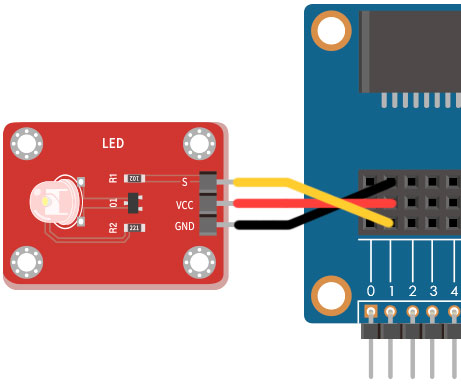
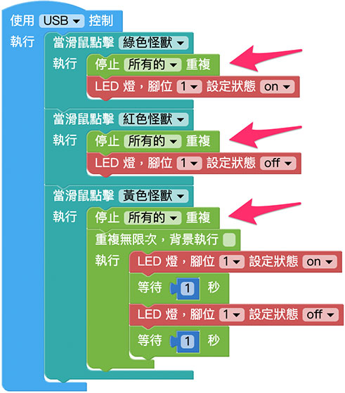

# LED

LED 是發光二極體 ( Light-emitting diode ) 的縮寫，是一種能發光的半導體電子元件，目前能夠發出可見光、紅外光一直到紫外光的光線，近年來更逐漸發展至各種照明用途，本篇所使用的 LED 是專門用於小型電子設備的材料，透過 Web:Bit 發送對應的訊號即可進行控制。

## LED 積木清單

LED 積木可以設定腳位以及指定狀態為 ON 或 OFF。

## LED 接線圖

如果是使用擴充套件包的 LED 模組，將 S 訊號腳連接 Web:Bit 擴充板的 1 號腳，VCC 連接 3V3，GND 連接 GND。

## LED 閃爍

將 LED 的積木放在「重複無限次」的迴圈裡，將第一個 LED 積木狀態設定為 ON，等待一秒後放入第二個 LED 狀態為 OFF 的積木，最後再放入一個等待一秒的積木，程式執行之後，就會看見 LED 開始閃爍。

## 點擊小怪獸控制 LED

放入「當滑鼠點擊怪獸」的積木，設定點擊綠色怪獸就會點亮 LED ( 狀態 ON )，點擊紅色怪獸時關閉 LED ( 狀態 OFF )，點擊黃色怪獸就讓 LED 閃爍 ( 延續上方 LED 閃爍的積木程式 )，完成後在所有怪獸的點擊積木裡，需要額外放入「停止所有迴圈」的積木，如此才能在 LED 亮起或熄滅時停止閃爍，也能避免閃爍迴圈重複疊加的情形發生。

> 範例：[點擊小怪獸控制 LED](https://webbit.webduino.io/blockly/?demo=default#8qMJ9M0Wj8D3W)

## 使用 Web:Bit 按鈕開關控制 LED

如果要使用 Web:Bit 開發版的按鈕控制 LED 燈，可以將上方小怪獸的積木，換成按鈕開關的積木，按下 A 的時候會點亮 LED ( 狀態 ON )，按下 B 就關閉 LED ( 狀態 OFF )，A 和 B 同時按下就讓 LED 閃爍 ( 延續上方 LED 閃爍的積木程式 )

> 範例：[使用 Web:Bit 按鈕開關控制 LED](https://webbit.webduino.io/blockly/?demo=default#py6lPpWKDzXqZ)

