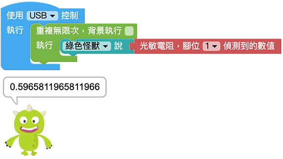
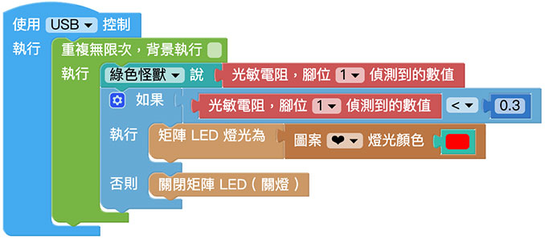

# 光敏電阻

光敏電阻常見於小夜燈裡面，光敏電阻主要是利用光電導效應的一種特殊的電阻，當有光線照射時，電阻內原本處於穩定狀態的電子受到激發，成為自由電子。所以光線越強，產生的自由電子也就越多，電阻就會越小，透過會變化的電阻值，進一步產生輸出強弱訊號。

> 如果要使用光敏電阻，需搭配 Web:Bit 擴充板，購買方式請參考：[Web:Bit 擴充板](https://store.webduino.io/products/webbit-extension-board?utm_source=webbit&utm_medium=article#_blank)

## 光敏電阻 積木清單

光敏電阻積木可以透過指定的腳位，讀取外在光線的數值 ( 0～1 的小數點數值 )

## 光敏電阻 接線圖

將擴充套件包裡的光敏電阻的 S 連接 Web:Bit 開發板 1 號腳，VCC 連接 3.3V，GND 連接 GND。

> 如果要使用光敏電阻，需搭配 Web:Bit 擴充板，購買方式請參考：[Web:Bit 擴充板](https://store.webduino.io/products/webbit-extension-board?utm_source=webbit&utm_medium=article#_blank)

## 小怪獸顯示光線數值

將「小怪獸說話」的積木放入「重複無限次」的積木裡，再將「光敏電阻，腳位 X 偵測到的數值」連接小怪獸積木，程式執行後，就會看見小怪獸講出光線的數值，環境越亮數字越大 ( 最大 1 )，反之數字越小 ( 最小 0 )。

使用「四捨五入」搭配「尺度轉換」的積木，能將偵測到 0～1 的小數點數值，轉換為 0～1000 的整數。( 亦可轉換成任意區間的數值 )，程式執行後，就會看見剛剛的小數點數值，已經轉換成整數了。

## 小夜燈

延續上面的程式，搭配「邏輯」的積木，判斷數值小於 0.3 時，讓 Web:Bit 的 LED 矩陣顯示紅色愛心，反之大於等於 0.3 的時候熄燈，程式執行後，用手遮蔽光敏電阻，就會看見小夜燈的效果。

> 範例：[小夜燈](https://webbit.webduino.io/blockly/?demo=default#Jy1dv1BmlxZ3l#_blank)

