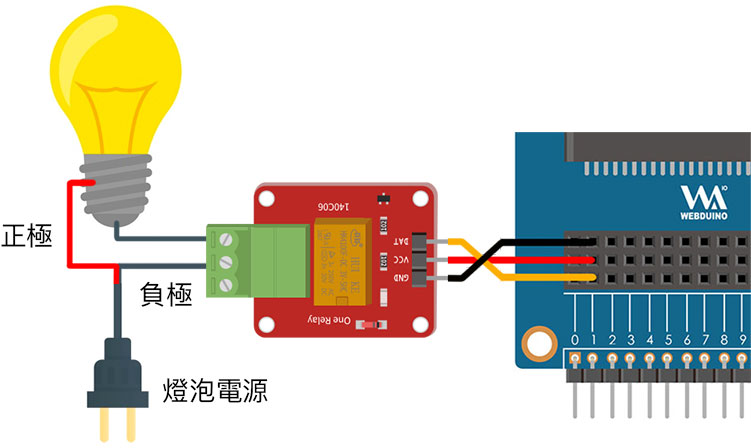
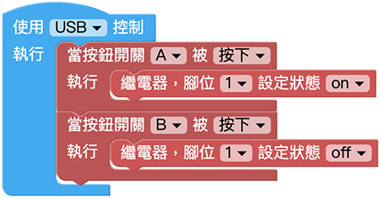

# 繼電器

繼電器是一種電子控制器件，它具有控制系統和被控制系統，通常應用於自動控制電路中，是用較小的電流去控制較大電流的一種「自動開關」，本篇教學會介紹如何透過 Web:Bit 開發版控制繼電器，做出利用網頁控制的智慧插座或自動開關。

> 如果要使用繼電器，需搭配 Web:Bit 擴充板，購買方式請參考：[Web:Bit 擴充板](https://store.webduino.io/products/webbit-extension-board?utm_source=webbit&utm_medium=article#_blank)

## 繼電器 積木清單

繼電器積木可以設定腳位以及指定狀態為 ON 或 OFF。

## 繼電器 接線圖

繼電器的內部構造有一個電磁鐵，在沒有訊號提供時，內部的簧片會在上方，這時候「常閉」與「公共端」是通路，「常開」和「公共端」是斷路，當電磁鐵透過訊號通電，就會將內部的簧片往下吸附，此時「常閉」與「公共端」變成斷路，「常開」和「公共端」變成通路，藉由這個方式，我們就可以很容易的控制電器用品的開和關。

將擴充套件包裡的繼電器淺綠色的區塊放在右側 ( 如下圖 )，從上而下方別是「常閉」、「公共端」和「常開」。

將欲控制的燈泡電源負極切成兩半，一端連接繼電器的「公共端」和插座，一端連接繼電器的「常開」和燈泡，繼電器的另一端 DAT 訊號腳連接 Web:Bit 擴充板的 1 號腳，VCC 連接 3V3，GND 連接 GND。

## 點擊小怪獸控制繼電器

放入「當滑鼠點擊怪獸」的積木，設定點擊綠色怪獸就會將繼電器狀態設定為 ON，點擊紅色怪獸時將繼電器狀態設定為 OFF，執行程式後，就可以點擊小怪獸來控制繼電器。

> 範例：[點擊小怪獸控制繼電器](https://webbit.webduino.io/blockly/?demo=default#rybdKvQOGNKqk#_blank)

## 使用 Web:Bit 按鈕開關控制繼電器

如果要使用 Web:Bit 開發板的按鈕控制繼電器，可以將上方小怪獸的積木，換成按鈕開關的積木，按下 A 的時候會將繼電器狀態設定為 ON，按下 B 就設定為 OFF )，執行程式後就可以透過開發板的按鈕開關來控制繼電器。

> 範例：[使用 Web:Bit 按鈕開關控制繼電器](https://webbit.webduino.io/blockly/?demo=default#EqdrzX5mr86y#_blank6)

