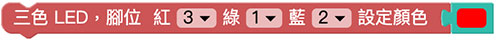
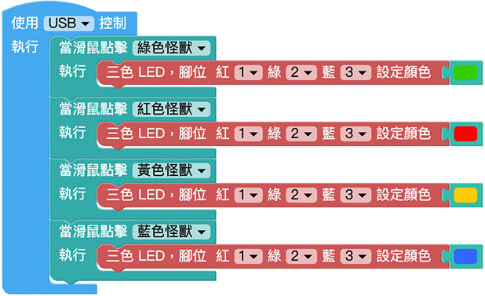

# 三色 LED

三色 LED 是由紅、綠、藍，三種不同顏色的 LED 所組成，因此可以發出最少三種顏色的光，也由於三色 LED 內部含有三顆 LED 燈，所以它具有 VCC、R、B、G 四支針腳，我們也可以分別控制個個顏色的強弱，進一步達到混合顏色的效果。

> 如果要使用三色 LED，需搭配 Web:Bit 擴充板，購買方式請參考：[Web:Bit 擴充板](https://store.webduino.io/products/webbit-extension-board?utm_source=webbit&utm_medium=article#_blank)

## 三色 LED 積木清單

三色 LED積木可以設定紅色、綠色、藍色的腳位，以及指定要呈現的顏色。

## 三色 LED 接線圖

使用擴充套件包的三色 LED 模組，將 VCC 連接 Web:Bit 擴充板的 3V3，R 連接 1 號腳，G 連接 2 號腳，B 連接 3 號腳。

## 點擊小怪獸改變三色 LED 顏色

放入「當滑鼠點擊怪獸」的積木，設定點擊綠色怪獸就會顯示綠色、點擊紅色怪獸顯示紅色、點擊綠色怪獸顯示綠色、點擊藍色怪獸顯示藍色，程式執行後，點擊對應的怪獸就會出現對應的顏色。

> 範例：[點擊小怪獸改變三色 LED 顏色](https://webbit.webduino.io/blockly/?demo=default#YqKrZ8QQJEKR4#_blank)

