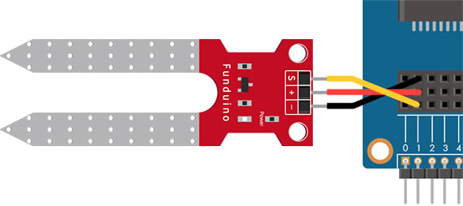
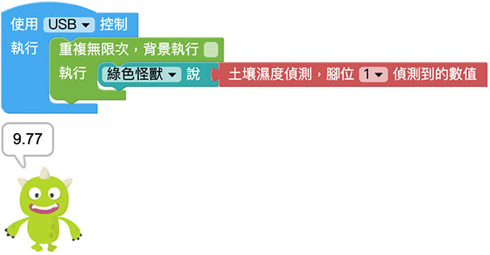
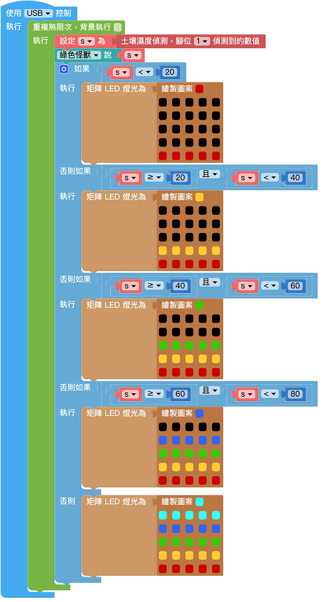

# 土壤濕度偵測

土壤濕度計主要可以偵測土壤濕度，以可簡易監控水位高低，原理其實是偵測兩塊金屬片的導電度換算成濕度，當溼度越高導電度也越高，常用在智慧植栽或智慧農業的領域。

> 如果要使用土壤濕度偵測，需搭配 Web:Bit 擴充板，購買方式請參考：[Web:Bit 擴充板](https://store.webduino.io/products/webbit-extension-board?utm_source=webbit&utm_medium=article#_blank)

## 土壤濕度偵測 積木清單

土壤濕度偵測的積木可以指定腳位，讀取偵測到的濕度數值 ( 0～100，0 最乾，100 最濕 )。

## 土壤濕度偵測 接線圖

將擴充套件包裡的土壤濕度計的 S 連接 Web:Bit 開發板 1 號腳，+ 連接 3.3V，- 連接 GND。

## 小怪獸顯示土壤濕度

將「小怪獸說話」的積木放入「重複無限次」的積木裡，再將「土壤濕度偵測，腳位 X 偵測到的數值」連接小怪獸積木，程式執行後，用手同時按壓土壤溼度計的兩片金屬片，或將土壤濕度計插入水中 ( 或土壤中 )，就會看見小怪獸講出對應的數值，環境越潮濕數字越大 ( 最大 100 )，反之數字越小 ( 最小 0 )。

## 透過矩陣 LED 顯示濕度

延伸上方的程式，加入邏輯判斷，判斷「0～20」、「20～40」、「40～60」、「60～80」和「80 以上」五個區間，每個區間分別顯示不同的矩陣 LED 燈號，程式執行後，用手同時按壓土壤溼度計的兩片金屬片，或將土壤濕度計插入水中 ( 或土壤中 )，就會看見 Web:Bit 的燈號隨之變化。

> 範例： [透過矩陣 LED 顯示濕度](https://webbit.webduino.io/blockly/?demo=default#byr1mQvrO6O3m#_blank)

