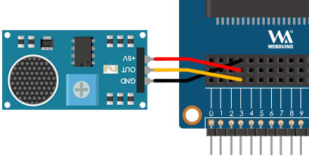

# 聲音感測器

聲音感測器類似一個微型的麥克風，不過它的功能並不像真正的麥克風一樣，只能用來偵測「是否有聲音」，在聲音感測器上頭有一個小型的十字旋鈕，可以用螺絲起子旋轉調整零敏度，靈敏度如果太高，可能連同一些風吹草動的聲音都會偵測到，靈敏度過低可能連鼓掌拍手都偵測不到。

> 如果要使用聲音感測器，需搭配 Web:Bit 擴充板，購買方式請參考：[Web:Bit 擴充板](https://store.webduino.io/products/webbit-extension-board?utm_source=webbit&utm_medium=article#_blank)

## 聲音感測器積木清單

聲音感測器的積木可以指定偵測腳位，讀取是否有聲音的變化，屬於持續偵測的積木，不需要搭配迴圈就能即時偵測。

## 聲音感測器接線圖

將擴充套件包裡的聲音感測器的 S 連接 Web:Bit 開發板 3 號腳，5V 連接 3.3V，GND 連接 GND。

## 聲音感測器改變小怪獸情緒

放入「當聲音傳感器，腳位 X 偵測到聲音有變化」的積木，再偵測到聲音變化時，讓綠色怪獸講話並且將情緒設定為「驚訝」，接著再放入同樣一個聲音感測器積木，下拉選單選擇「沒有」偵測到聲音變化，在沒有偵測到聲音變化時，將綠色怪獸恢復正常情緒且不說話，程式執行後，用手指輕拍聲音感測器，就能看到小怪獸做出反應。

