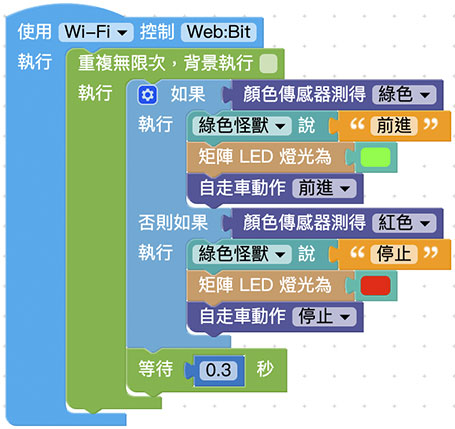

# Web:Bit MoonCar 顏色識別

MoonCar 除了「辨識（黑色）路徑軌跡」以外，MoonCar 還具備了「地板顏色識別」功能。搭配套件中所附贈（或自備）的顏色卡片，就可以透過這項功能，來讓 MoonCar 識別出當下所在（區域）位置，進而讓 MoonCar 做出相對應的處理。

## 積木清單

## 基本識別功能
這個聰明的顏色識別功能很簡單，透過 MoonCar 以底盤前方左側的顏色感測器模組，搭配迴圈和邏輯積木，來判斷小車目前是否正行駛在指定顏色的地板（或卡片）上。

## 簡單應用
由於 MoonCar 小車現在可以識別出地板的顏色，因此我們就可以搭配小車的移動控制積木，來把地板顏色當成用來控制小車行動的指令。

例如：底下所示範的，就是類似交通號誌般，讓小車「綠色行，紅色停」的簡單應用。

