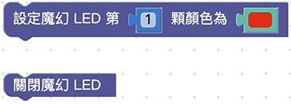
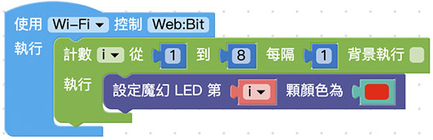

# Web:Bit MoonCar 魔幻 LED

MoonCar 除了 Web:Bit 內建的 5 x 5 矩陣 LED 外，在 MoonCar 小車的四周還額外增加了 8 顆全彩 LED，以便讓大家可以依照需要，做出更炫的燈號效果。

## 積木清單

## 基本亮燈控制

就和原本 Web:Bit 內建的 矩陣 LED 那樣，若希望哪顆 LED 呈現出某種顏色，就只要直接指定相對應的 LED 編號和顏色即可。若要將 8 顆 魔幻 LED 同時指定成同一種顏色，則可以搭配重複迴圈即可。

另外，再搭配變數和數學的隨機積木，就可以讓 魔幻 LED 呈現出不斷以各種顏色來進行閃爍的魔幻效果！

