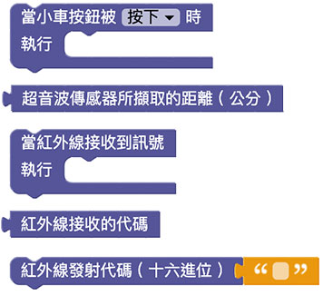

# Web:Bit MoonCar 其他元件 ( 按鈕、超音波、紅外線 )

MoonCar 小車另外還內建了一顆按鈕元件，以及基本套件包才有的紅外線和超音波元件。讓大家可以根據需要，加入更多的互動方式。

## 積木清單

若要使用 MoonCar 上的這些內建元件，除了記得要使用它所附帶的擴充積木以外，其控制和應用方式都和其他教學一樣。因此，請直接參考相關教學：

> - 按鈕參考：[Web:Bit 按鈕開關](../board/ab-button.html)。
>
> - 超音波傳感器請參考：[超音波傳感器](../extension-basic-package/ultrasonic.html)。
>
> - 紅外線 ( 發射 & 接收 ) 請參考：[紅外線發射&接收](../extension-basic-package/ir.html)。
