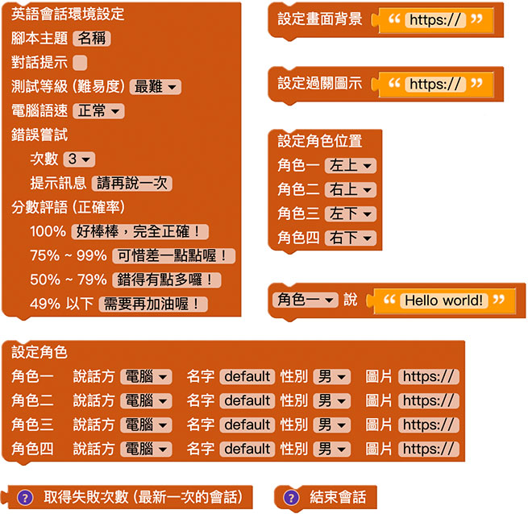

# 英語會話 ( 使用程式積木 )

在 Web:Bit 教育版的擴充功能裡，可以自己設計英語會話的遊戲與應用情境，部署之後，在小怪獸舞台產生與眾不同的互動效果，這篇文章將會介紹透過程式積木的方法設定英語會話。

延伸 [英語會話 ( 使用 Google 試算表 )](spread-sheet.html)，登入凱比物聯網教室後，開啟英語會話擴充功能，在左側積木清單的擴充功能裡，選擇「英語會話」的積木，除了第一塊「載入 Google 試算表關卡模板」是獨立運作，其他的積木能做出互動式的英語會話的互動情境，以下將會介紹這些積木以及相關用法。

## 積木 - 環境設定 ( 一次性 )

「英語會話環境設定」的積木，在一個英語會話的程式裡「*只能使用一次*」，主要作用為設定整體英語會話的環境，包含主題名稱、提示、等級、語速、嘗試次數、分數評語的相關設定選項。

## 積木 - 關卡設定 ( 不同關卡可套用不同設定 )

「畫面背景」、「過關背景」、「角色設定」和「角色位置」這四個積木，會在不同的關卡開始之前進行設定，例如機場的關卡就可套用機場的背景以及空服員的角色，麵包店的關卡可以套用烘培坊的背景和廚師的角色，依此類推。

## 積木 - 關卡內容  ( 不同關卡可使用不同內容 )

設定環境和關卡之後，透過「角色說...」的積木，就能讓角色依序發聲對話，「*如果角色是使用者，則會要求使用者透過麥克風朗讀語音*」，藉由人工智慧判斷正確率，此外亦可透過「取得失敗次數」和「結束會話」，進行更多的互動效果。

## 設計一段英語會話

放入環境設定積木 ( 全部採用預設值 ) 以及背景圖片的積木。

前往 Google 圖片搜尋，搜尋一張理想的背景圖 ( 範例搜尋是 mario background )，點擊圖片之後，用滑鼠在圖片上按右鍵，複製圖片的網址。

回到背景圖片的欄位，貼上背景圖片的網址。( 因為是 Google 圖片搜尋，所以相關程式請勿商業使用，除非確認該圖片可以商業使用 )

放入過關圖片的積木，Google 圖片搜尋 good job，找到合適的圖片複製網址並貼到欄位中。

放入角色設定的積木，設定角色 1 是名為馬力歐的電腦，角色 2 是名為壞力歐的使用者，並隱藏角色 3 和 4 。

前往 Google 圖片搜尋馬力歐的圖片，使用「工具」搜尋「透明」的圖片。

找到合適的圖片，複製網址，貼上積木對應的欄位。

同樣的做法，搜尋壞力歐的背景透明的圖片，複製網址，貼上積木對應的欄位。

放入設定角色位置的積木，設定角色 1 在左下，角色 2 在右下，角色 3 和 4 設定為隱藏。

放入角色對話的積木，輸入要對話的內容。

最後在積木一開始的位置，放入「設定怪獸舞台為全螢幕」以及「所有怪獸隱藏」的積木。

程式執行後，就可以進行相關的英語對話練習。

> 範例參考：[英語會話 ( 使用程式積木 )](https://kebbi-iot.webduino.io/webbit/?demo=default#rybdKaz5WOaqk)

