# Web:Bit 擴充功能：Google 簡報

Google 簡報是 Google 提供的免費服務，學生們可以透過 Google 簡報來學習演講報告、整合學習內容、美術設計、團隊協作等等。而 Web:Bit 簡報積木更能夠搭配程式積木，使用聲控、光感、按鈕等物聯網功能控制簡報，在學習物聯網同時利用 Google 簡報展現成果。

## 顯示 Google 簡報

「顯示 Google 簡報」積木只需要填入簡報網址，就能在小怪獸舞台中顯示簡報畫面。

### 共用試算表

在使用 Google 簡報積木前，需要先建立簡報，並將簡報開啟共用。

1. 登入 Google 帳號，在雲端空間中按下「右鍵」，選擇「Google 簡報」。

    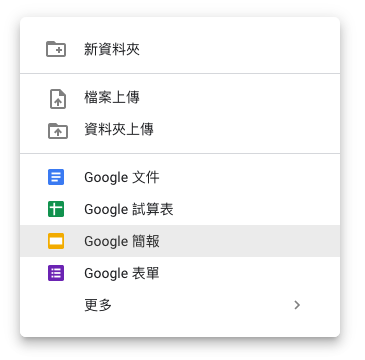

2. 建立簡報後，編輯標題和內容。

    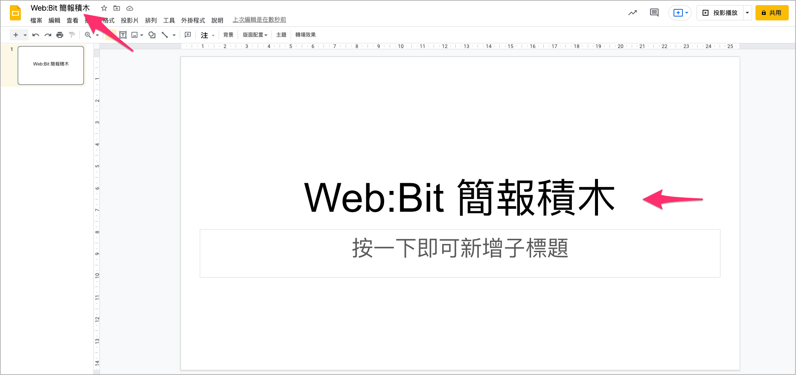

3. 點擊右上角「共用」，將「知道連結的使用者」設定為「檢視者」，點擊「完成」。

    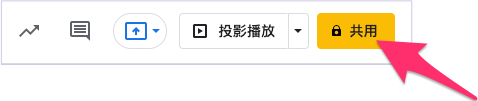

    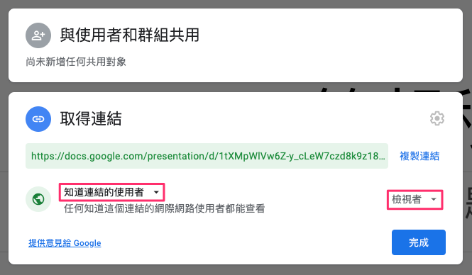

4. 點擊「複製連結」，這段連結需要貼入積木中，按下「完成」，即完成簡報設定。

    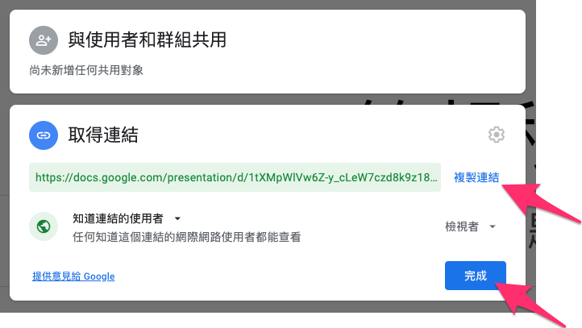

### 積木使用

1. 將複製的簡報連結貼入「顯示 Google 簡報」積木。

    

2. 按下執行，即可看到在小怪獸舞台顯示簡報。

   

3. 也可以點擊「展開」按鈕，將簡報全螢幕顯示。

    

    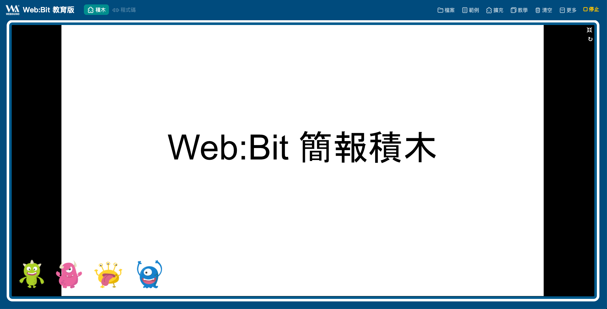

## 回到上一頁 / 進入下一頁

「回到上一頁」積木及「進入下一頁」積木可以控制簡報的頁面切換。

### 範例：小怪獸控制簡報

<!-- https://testwbit.webduino.tw/blockly/#rybb16bpDnmyk -->

使用「滑鼠點擊小怪獸」積木搭配「回到上一頁」積木及「進入下一頁」積木，就可以做到點擊綠色、紅色小怪獸控制簡報頁碼切換。

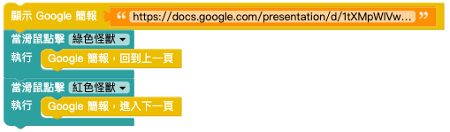

## 前往頁碼

「前往頁碼」積木可以直接前往指定的頁碼。

### 範例：小怪獸簡報控制器

<!-- https://testwbit.webduino.tw/blockly/#03lYm9mYZ1Nyv -->

延續上一個範例，增加一塊「滑鼠點擊小怪獸」積木，搭配「前往頁碼」積木，控制簡報前往第一頁。

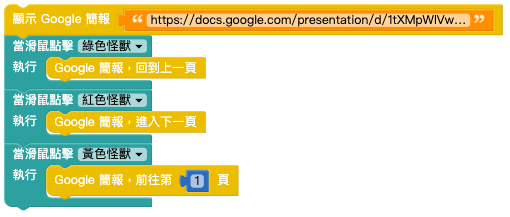

## 目前頁數 / 全部頁數

「目前頁數」積木及「全部頁數」積木可以顯示簡報目前的頁數以及簡報的全部頁數。

### 範例：小怪獸說頁碼

<!-- https://testwbit.webduino.tw/blockly/#jqwKOY8YDNxqO -->

1. 延續上一個範例。

    

2. 使用「字串」積木搭配「目前頁數」積木及「全部頁數」積木，組成下圖。

    

3. 搭配「小怪獸說話」積木、「重複」積木，讓小怪獸重複說出頁數。

    

4. 組合積木如下圖，按下執行，當點擊小怪獸切換頁面時，可以看到小怪獸會說出現在的頁數。

   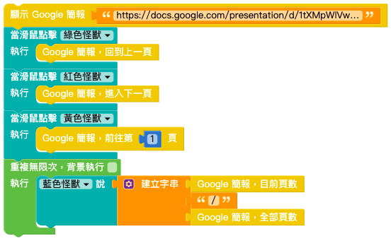

   

## 進階範例：光感簡報控制器

只要揮動手，就能藉由偵測光線來控制簡報頁碼切換。

1. 使用「開發板」積木輸入開發板 DeviceID，放入「顯示 Google 簡報」積木，並輸入簡報網址。

    > 可以使用「模擬器」來執行，若要符合物聯網情境，建議使用 Web:Bit 開發板。

   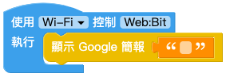

2. 使用「目前頁數」積木及「全部頁數」積木，搭配「文字」積木做出如下：

    

3. 使用「邏輯」積木、「偵測光線」積木、「回到上一頁」積木。
如果左上亮度 < 100，執行簡報回到上一頁。

    > 因為各環境光線不同，需要依據現場調整光度數值。

   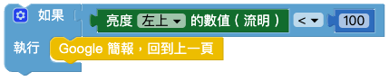

4. 重複步驟 3. 做出：如果右上亮度 < 100，執行簡報前往下一頁。

    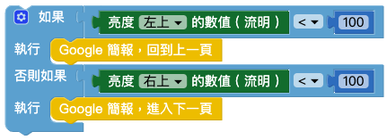

5. 使用「重複」積木讓程式能夠不斷執行，完成後就可以偵測手部位置來控制簡報。

    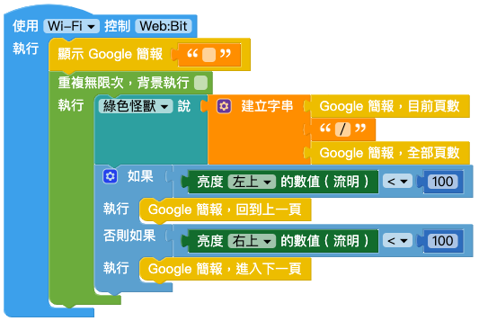
