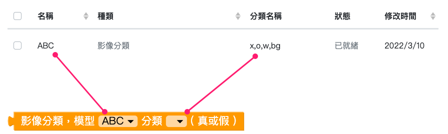
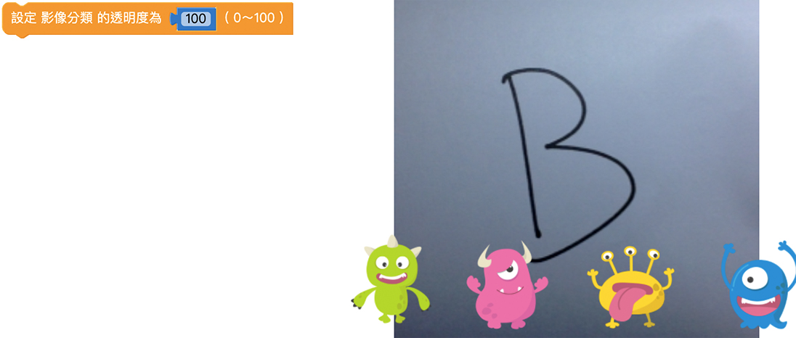
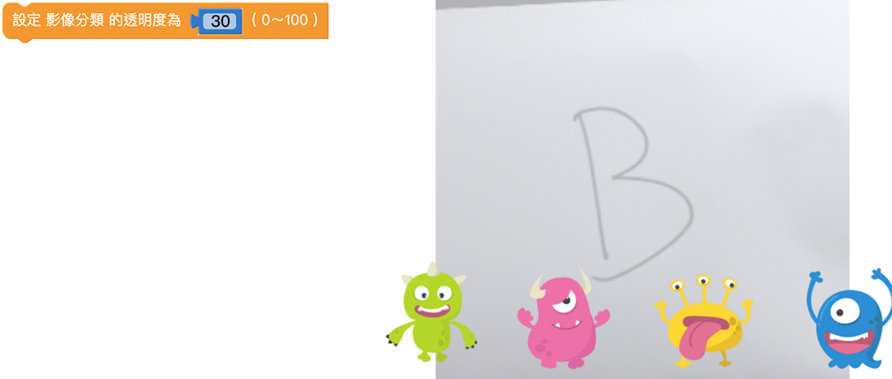
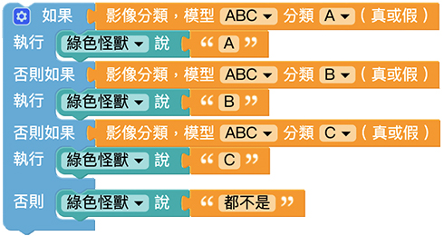
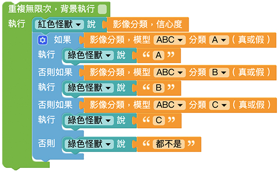
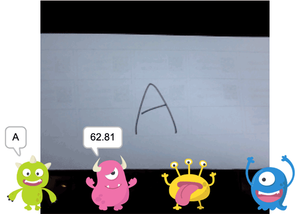

# 影像分類

擴充功能中的影像分類功能可以使用程式積木，配合訓練好的影像辨識模型來辨識偵測到的物體。
本文會先列出「影像分類」積木的各種功能，再介紹影像分類的程式操作步驟，因為會需要使用到 [影像訓練](https://md.kingkit.codes/s/g0MObOuu7) 的分類模型，所以在執行「影像分類」積木前，您需要先至影像訓練平台建立分類和模型。

## 鏡頭來源

「鏡頭來源」積木可以選擇使用鏡頭訊號的來源，分為：
- 視訊鏡頭：使用電腦內建視訊鏡頭。
- 鏡頭網址：使用 [WebEye](https://store.webduino.io/products?query=webeye) 等裝置時，能夠取得網頁中的影像。

## 模型分類

「模型分類」積木表示辨識到的影像是某模型中的某分類。透過下拉選單，可以將影像訓練建立的模型和分類名稱設定到積木中，讓程式判斷辨識結果是否為真，再搭配其它積木執行後續動作。

積木下拉選單中的模型分類會對應到您在 [影像訓練](https://md.kingkit.codes/s/g0MObOuu7) 中建立的模型和分類。這裡的例子是使用「模型 ABC」及其分類。

## 信心度

「信心度」積木能夠讀取出影像辨識的信心度數值，單位為 ％。信心度最高為 100、最低為 0，若信心度越高，代表辨識錯誤的可能性越低。

> 因為影像訓練辨識的結果會落在一個區間範圍內，若信心度為 90%，代表有 90% 的機率真正的結果會落在這個區間範圍內。

## 透明度

「透明度」積木可以改變影像的透明度，數值可以是 0 ~ 100，0 為完全透明、100 為原始顏色 ( 透明度不變 )。

## 範例：影像分類

1. 首先建立影像分類模型。
2. 為了要在辨識的時候顯示信心度，使用「小怪獸講話」積木加上「信心度」積木，讓其中一隻小怪獸說出信心度的數值。

    

3. 再來要撰寫影像分類的邏輯程式，這裡的例子中會有 4 種辨識結果，包含「A」、「B」、「C」 和「都不是」。

    使用「如果執行」積木，後方加入「模型分類」積木，讓影像分類成功時執行下一動作。這裡的例子是讓小怪獸說出辨識結果，因此在「如果」、「否則如果」後方分別設定 3 種辨識結果，並讓小怪獸說出。
    
    因為辨識的物品有可能都不是分類的影像，所以在「否則」後方設定小怪獸說出「都不是」。

    

4. 完成影像分類的邏輯程式後，就能夠正常進行辨識，但是這樣的程式只能進行判斷一次，所以需要在最外側增加一個「重複」積木。這裡選用「無限重複」積木，可以讓程式不斷辨識影像，並顯示辨識結果。

    

5. 完成之後按下執行，可以看到隨著鏡頭呈現的影像改變，小怪獸說出的辨識結果和信心度也會隨著改變。

