# 影像訓練

在影像訓練平台中，我們可以建立屬於自己的影像分類，並訓練影像辨識模型，透過這些訓練好的辨識模型，電腦就可以辨識鏡頭捕捉的影像是什麼物品。

## 影像訓練流程

1. 點擊「影像分類」積木右鍵，選擇「影像訓練平台」，進入影像訓練平台。
或直接點擊 [影像訓練平台](https://vision.webduino.io/) 連結進入。

    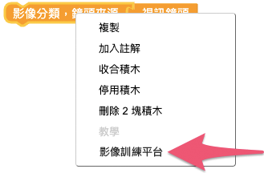

2. 在頁面中可以看到左側有「分類」和「模型」兩個選項，分別為「建立圖片庫」和「建立影像辨識模型」功能。

    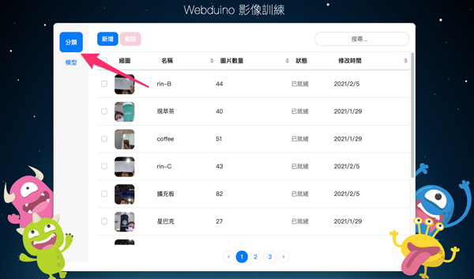

3. 進行影像辨識前，需要先分別建立影像分類和模型，接著將分類放入模型中，就可以使用模型來進行影像辨識了。

## 建立影像分類

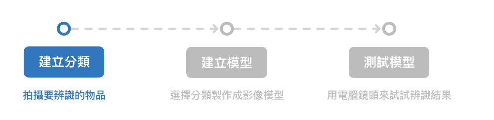

首先在左側的側邊列選擇「分類」。
「分類」是用來存放建立過的分類，可以從名稱、圖片數量、修改時間的排序和搜尋功能來找到已建立的分類。

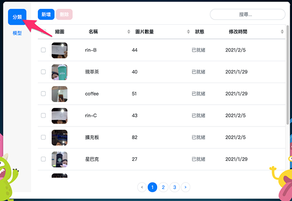

### 建立分類

按下藍色的「新增」按鈕，會跳出「建立分類」的視窗，接著輸入分類名稱和選擇分享狀態，「私人分類」代表只有自己的帳號才能使用此分類；「公開分類」代表所有人都可以使用。

再來選擇影像上傳方式，可以從 4 種不同方式上傳影像，分別是：

- 上傳影像：從自己的電腦中上傳影像，可選擇上傳影像檔或 zip 檔。
- 攝影鏡頭：使用裝置的攝影鏡頭拍攝影像。
- 既有分類：從自己的分類列表中選擇多個分類，建立成一個新的分類。
- 公開分類：使用他人建立的公開分類來建立分類。

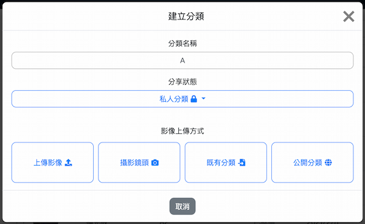

建立完成後，就可以在分類列表中看到剛剛建立的分類了。

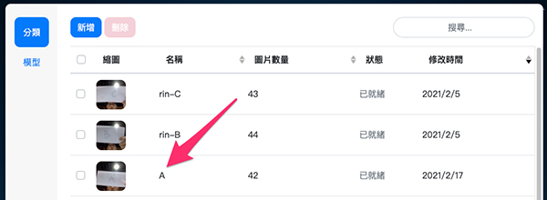

### 使用攝影鏡頭上傳影像

1. 選擇「攝影鏡頭」，會進入到擷取影像的頁面，這裡需要使用裝置相機，相機權限選擇「允許」。
2. 等到相機畫面出現就可以按下綠色「擷取影像」按鈕來拍照，移動物品來讓鏡頭擷取不同角度和位置的影像，擷取影像的數量越多，影像辨識的準確度會越高。
3. 擷取完影像後，點擊「建立分類」按鈕，就可以在分類列表中看到剛剛建立的分類了。

> 按下 **紅色「清除影像」按鈕** 後，會將擷取的影像 **全部刪除**，點擊之前請先注意！

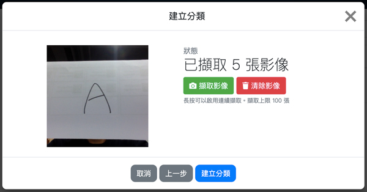

### 修改分類

在分類列表中點選其中一項分類，會跳出「修改分類」的視窗，在這裡可以修改分類的名稱和分享狀態，也可以透過 4 種影像上傳方式新增分類中的影像。修改完成後點擊「修改並儲存」按鈕，就可以完成修改。

> 在修改分類功能中，只能增加影像，無法刪除分類中的影像。

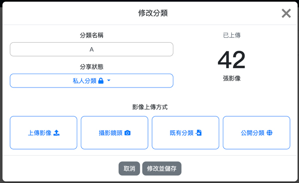

### 刪除分類

在分類列表中，可以勾選多個分類後刪除。

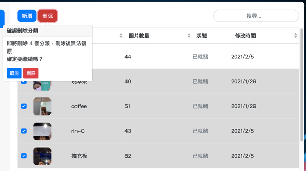

## 建立影像模型

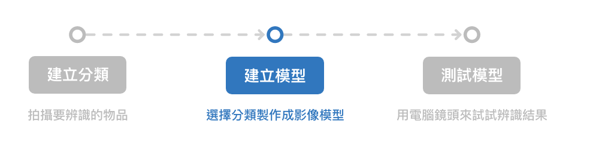

建立完分類後，在左側的側邊列選擇「模型」。
「模型」中的列表是用來存放建立過的模型，可以從名稱、修改時間的排序和搜尋功能來找到已建立的模型。

> 影像模型分為：「影像分類」及「物件追蹤」，而 Web:Bit 教育版目前僅支援影像分類功能。

### 新增模型

按下藍色的「新增」按鈕，會跳出「新增模型」的視窗，接著輸入模型名稱和選擇分享狀態，「私人模型」代表只有自己的帳號才能使用此模型；「公開模型」代表所有人都可以使用。

再來選擇模型建立方式，可以從 3 種不同方式建立模型，分別是：

- 挑選分類：從分類列表中挑選建立過的分類來建立模型。 ( 分類數量需為 2 個以上 )
- 複製既有模型：從模型列表中複製曾經建立過模型。
- 複製公開模型：複製他人建立的公開模型。

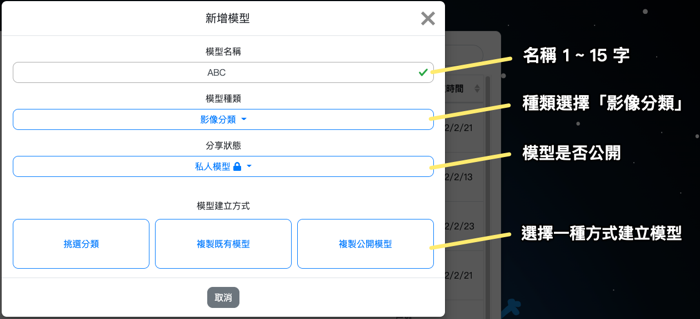

點選「建立模型」後，就可以在模型列表中看到剛剛建立的模型了。

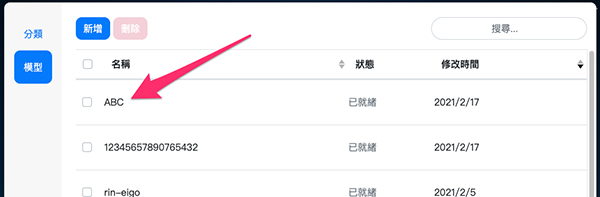

> 若模型訓練等待過久，讓頁面重新整理，就可以看到建立的模型訓練完成了。

### 挑選分類

如果使用「挑選分類」來建立模型，需要選擇 2 個以上的分類放入模型中，才能辨識出不同的結果。

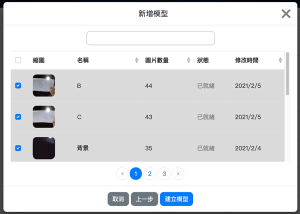

> 建議多放入一個 **背景** 分類，因為當沒有偵測到物件時，辨識結果會顯示為其中一項分類。如果有放入 **背景** 分類，就能正常顯示辨識結果為背景。

### 修改模型

1. 在模型列表中點選其中一項模型，會跳出「修改模型」的視窗，選擇「修改模型」進入下個頁面。
2. 在這裡可以修改模型的名稱和分享狀態，也可以修改進階設定中的影像辨識數值。修改完成後點擊「修改並儲存」按鈕，就可以完成修改。

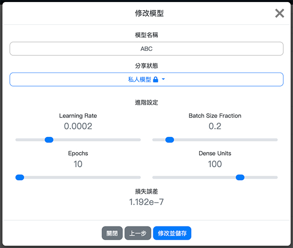

>- 如果點選的是複製的模型，會無法使用「修改模型」功能。
>- 調整進階設定中的影像辨識數值會影響辨識的誤差和信心度，一般建議使用預設的數值。

### 刪除模型

在模型列表中，可以勾選多個模型後刪除。

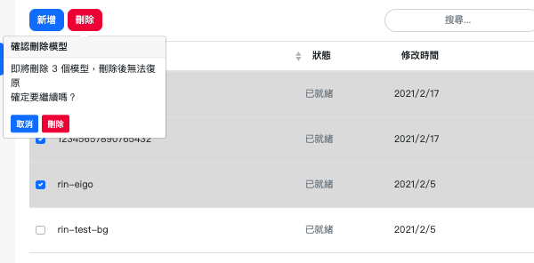

## 測試模型

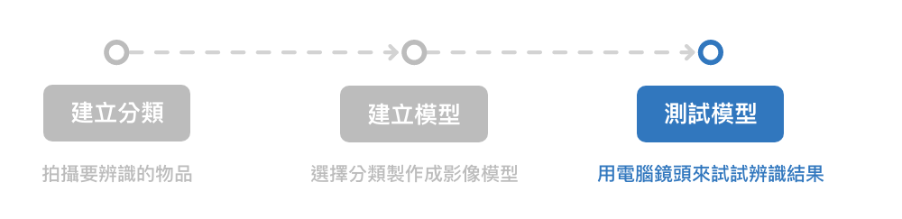

模型建立完成後，可以使用「測試模型」功能來測試模型的辨識效果。
從模型列表中點選欲使用的模型，會跳出「修改模型」的視窗，選擇「測試模型」進入「測試模型」頁面，就可以開始進行影像辨識。
開始辨識後，會顯示辨識結果和信心度，若信心度百分比越高，代表辨識錯誤的可能性越低。

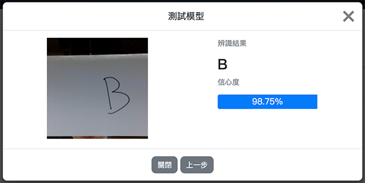

>- 辨識結果會因為場地的光線、背景、裝置鏡頭的角度而影響，因此對同一目標的辨識結果和信心度都會不同。
>- 因為影像訓練辨識的結果會落在一個區間範圍內，若信心度為 90%，代表有 90% 的機率真正的結果會落在這個區間範圍內。
