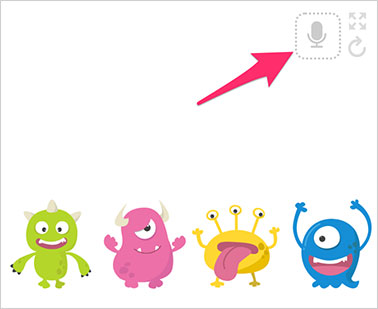
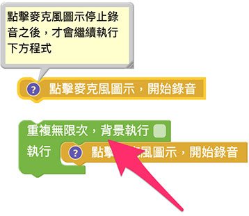

# Web:Bit 錄音＆音量

因為 Web:Bit 教育版是透過瀏覽器運作，可以很輕鬆搭配電腦麥克風，藉由麥克風錄音或麥克風的音量大小變化，做出各種和聲音有關的物聯網互動。

## Web:Bit 錄音＆音量積木清單

「錄音＆音量」積木包含開始錄音、播放錄音、麥克風的錄音和麥克風的音量四種。

## 點擊麥克風圖示，開始錄音{{microphone01}}

「點擊麥克風圖示，開始錄音」積木可以讓使用者透過電腦麥克風錄音。

這塊積木在程式執行後，怪獸舞台會出現一個「麥克風圖示」。

點擊麥克風圖示，啟用電腦的麥克風授權，就可以開始錄音。

開始錄音後，麥克風圖示會變成「紅色閃爍」的麥克風，再次點擊就可以停止錄音。

麥克風積木在使用上有兩點注意事項：

> - 錄音時，積木流程會暫停，直到手動停止錄音才會繼續
>
> - 錄音停止後，麥克風圖示會消失，可透過「重複迴圈」進行重複錄音

## 播放錄音＆麥克風的錄音{{microphone02}}

「播放錄音」積木搭配「麥克風的錄音」積木，就能播放剛剛的錄音檔案。

舉例來說，先放上「點擊麥克風圖示，開始錄音」積木，接著放入「點擊小怪獸」的積木，在點擊小怪獸的時候，播放麥克風錄音，程式執行後，先點擊怪獸舞台的「麥克風圖示」開始錄音，再次點擊麥克風圖示結束錄音，錄音結束後，點擊小怪獸，就會播放剛剛的錄音檔案。

搭配重複迴圈、變數和陣列，就能夠讓每隻小怪獸都講出不同的錄音，下面的例子透過「重複四次」的迴圈，讓陣列紀錄四次錄音檔案，再依序設定點擊不同小怪獸，播放不同錄音檔案。

> - 注意，每次執行錄音時，都必須點擊「麥克風圖示」才會開始錄音
>
> - 範例連結：[點擊不同小怪獸播放不同錄音](https://webbit.webduino.io/blockly/?demo=default#rybdKPnGJ5Mqk#_blank)

## 麥克風的音量{{microphone03}}

「麥克風的音量」積木可以取得麥克風目前的音量數值，數值範圍是 0 ( 最小聲 ) 到 100 ( 最大聲 )。

「麥克風的音量」積木的使用必須搭配「重複迴圈」，下面的範例透過重複無限次的迴圈，搭配小怪獸，講出目前麥克風的音量大小。

> 注意，若是第一次使用麥克風，需要啟用電腦的麥克風授權。

