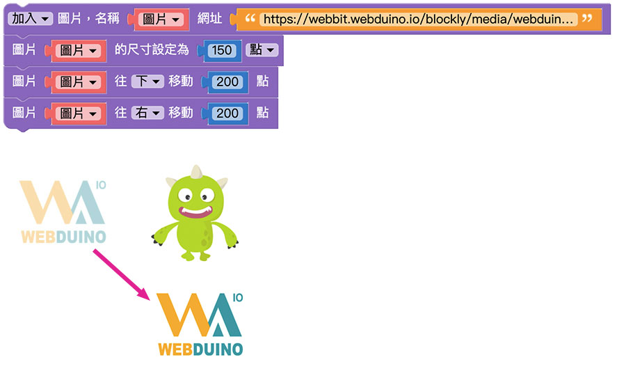
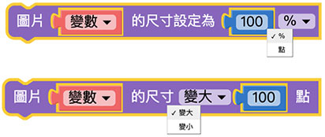

# Web:Bit 擴充功能：圖片

擴充功能中的圖片積木可以改變圖片的樣式及位置，並將圖片直接顯示在小怪獸互動舞台中，搭配 Web:Bit 教育版中的其它功能，能夠對圖片做出更多的互動，實踐更多物聯網應用。

## 圖片積木清單

圖片積木包含圖片來源、圖片樣式、位置、互動、顯示、還原預設值等積木。

## 加入＆更換圖片{{picture-object01}}

「加入圖片」積木及「更換圖片」積木可以控制圖片的來源網址，決定展示哪一張圖片，並且可以將圖片的名稱命名為變數，藉由變數的命名可以讓後面的積木輕鬆控制圖片的樣式和互動。

為了展示更換效果，加入「滑鼠點擊小怪獸」積木，讓執行的時候能夠藉由點擊小怪獸觸發更換圖片。
在積木執行內放入「更換圖片」積木，將圖片名稱變數改為自己設定的名稱，並更改圖片網址，按下執行，就可以看到滑鼠點擊小怪獸後舞台內的圖片更換了。

 

 <!-- gif -->

> 一次可使用多個「加入圖片」積木，但是不能將多張圖片命名為同一個變數名稱。

## 圖片定位{{picture-object02}}

「圖片定位」積木是以小怪獸互動舞台的左下角為原點 (0,0)，透過設定 x、y 的數值，將圖片顯示在 xy 座標中的位置。

 

設定 x 為 100、y 為 100，按下執行，可以看到 Webduino 圖片在原點 ( 小怪獸舞台左下角 ) 往右 100、往上 100 的位置。

 

> - 因為位置的判定是以 *圖片的中心* 為準，因此當「圖片定位」積木設定成 *x 為 0、y 為 0* 時，圖片的中心剛好位在小怪獸舞台的左下角 ( 座標的原點 )，所以畫面中只會看到圖片的 1/4。
>
> - 若不使用「圖片定位」積木，圖片的預設位置：
    - x 座標 ( 圖片中心的 x 座標 )：原始圖片寬度的一半
    - y 座標 ( 圖片中心的 y 座標 )：原始圖片長度的一半 + 100
    - 例如 Webduino 圖片的大小為 400*400，那座標就會是 (200,300)

## 圖片移動{{picture-object03}}

「圖片移動」積木能夠控制圖片往上下左右四個方向移動，也可以互相搭配，達成往右上、右下、左上、左下移動。透過搭配其它觸發方式，可以在自己設定的時候觸發圖片移動。

 

放入 2 個「圖片移動」積木，設定往下 200 點、往右 200 點，按下執行，可以看到圖片往右下方移動。

 

## 圖片大小{{picture-object04}}

控制圖片大小的積木包含「圖片尺寸設定」積木和「圖片尺寸變化」積木，兩種積木的差別在於「圖片尺寸設定」積木是直接設定圖片的尺寸大小，而「圖片尺寸變化」積木是根據現在的圖片尺寸做改變。

- 「圖片尺寸設定」積木：若將圖片*尺寸設定為 50%*，會顯示圖片寬度為*原始的 50%*。
- 「圖片尺寸變化」積木：若設定圖片*尺寸變大 100 點*，會顯示圖片寬度為*原始寬度加上 100 點*。

範例是滑鼠觸碰小怪獸讓圖片改變大小，離開小怪獸後圖片恢復到原始大小。  
放入「滑鼠接觸小怪獸」積木，設定：  
- 碰到時執行尺寸變大 150 點  
- 離開時執行尺寸設定為 100%

按下執行，使用滑鼠觸碰小怪獸，可以看到圖片變大；滑鼠離開時，圖片恢復到原始的大小。

> - 在 Web:Bit 教育版中的圖片尺寸是 **以寬度為基準**，若圖片尺寸為 100 點，代表圖片寬度為 100 點、高度為符合圖片比例的數值。  
( 換句話說，積木中控制圖片的尺寸等於是控制圖片的寬度，並且圖片不會因為尺寸改變而失真。 )
>
> - 前面介紹的圖片位置的判定是以 *圖片的中心* 為準，因此圖片尺寸的改變並不會對圖片位置造成影響。  
( 例如：100% 和 200% 的圖片中心點會在相同位置 )

## 圖片旋轉{{picture-object05}}

控制圖片大小的積木包含「圖片旋轉」積木和「圖片左右旋轉」積木，兩種積木的差別在於「圖片旋轉」積木是以*原始圖片*的角度作旋轉；「圖片左右旋轉」積木是以*當下*圖片的角度作旋轉。

- 「圖片旋轉」積木：以*原始圖片*的角度為基準，圖片中心為圓心，順時針旋轉。
- 「圖片右旋轉」積木：以*當下*圖片的角度為基準，圖片中心為圓心，順時針旋轉。
- 「圖片左旋轉」積木：以*當下*圖片的角度為基準，圖片中心為圓心，逆時針旋轉。

使用「圖片旋轉」積木設定 60 度，可以看到圖片順時針旋轉 60 度。

若是想要達到不斷觸發旋轉的效果，可以使用「怪獸控制」積木搭配「圖片左右旋轉」積木。  
放入「滑鼠點擊小怪獸」積木，設定執行使用「圖片左旋轉」積木 10 度，可以看到每次點擊小怪獸，圖片都會逆時針旋轉 10 度。

## 圖片透明度{{picture-object06}}

「圖片透明度」積木可以改變圖片的透明度，數值可以是 0 ~ 100，0 為完全透明、100 為原始顏色 ( 透明度不變 )。

這裡嘗試將「圖片透明度」積木搭配「怪獸控制」積木，讓滑鼠觸碰到綠色小怪獸的時候能夠改變圖片的透明度。  
設定滑鼠觸碰時，圖片透明度為 30；滑鼠離開時，圖片透明度為 100。按下執行，可以看到圖片透明度會隨著滑鼠觸碰小怪獸而變化。

## 圖片階層{{picture-object07}}

「圖片階層」積木能夠控制圖片的上下順序位置，決定圖片是否會被小怪獸遮蔽。

在預設情況下執行，圖片會被小怪獸覆蓋。  
若放入「圖片階層」積木並設定*移到最上層*，執行後可以看到圖片顯示在小怪獸的上方。

## 滑鼠點擊圖片{{picture-object08}}

「滑鼠點擊圖片」積木能夠決定點擊圖片的觸發事件，在點擊圖片後執行後續動作。

> 滑鼠點擊積木「*不需要放在重複迴圈內*」就可重複偵測。

為了展示點擊效果，加入「小怪獸講話」積木，讓執行的時候能夠藉由點擊圖片讓小怪獸講話。  
在「滑鼠點擊圖片」積木執行內放入「小怪獸講話」積木，按下執行，就可以看到滑鼠點擊圖片後小怪獸說話了。

## 滑鼠觸碰圖片{{picture-object09}}

「滑鼠碰觸圖片」積木包含兩個行為動作，分別是滑鼠碰觸到圖片要做什麼事，以及滑鼠離開圖片要做什麼事。

> 注意，離開的行為一定會接續在碰觸之後，滑鼠碰觸積木「*不需要放在重複迴圈內*」就可重複偵測。

下圖的例子，在滑鼠碰觸到圖片時，圖片尺寸會變大，滑鼠離開後圖片又恢復原始大小。

## 圖片數值{{picture-object10}}

圖片數值包含 x、y 座標、長度、寬度、角度，可以用「圖片數值」積木清楚知道自己對圖片調整的數值，並且搭配其它積木顯示。

先任意對圖片做調整到想要的樣式，接著在後方放入「小怪獸講話」積木，放入想讓小怪獸說出的圖片數值。若是需要放入更多文字，可以利用「建立字串」積木同時顯示更多文字。

 <!-- 一張圖顯示5數值 -->

## 顯示隱藏圖片{{picture-object11}}

「顯示隱藏圖片」積木和「圖片透明度」積木不同，是直接將設定的圖片取消顯示，選單內也可以選擇顯示或隱藏圖片。

將積木設定為顯示，按下執行，可以看到 Webduino 圖片正常顯示。

將積木設定為隱藏，按下執行，可以看到原本的 Webduino 圖片直接被隱藏。

## 圖片還原預設值{{picture-object12}}

「圖片還原預設值」積木可以把前面的程式積木對圖片做的任何變化都還原成預設值。

> 圖片預設值：
> - x 座標 ( 圖片中心的 x 座標 )：原始圖片寬度的一半
> - y 座標 ( 圖片中心的 y 座標 )：原始圖片長度的一半 + 100
> - 大小：原始圖片尺寸
> - 旋轉：0 度
> - 透明度：100
> - 階層：預設 ( 小怪獸下方 )
> - 隱藏：正常顯示

先對圖片做不同的變化設定，讓圖片產生不同的樣式變化。

在下方加入「圖片還原預設值」積木，按下執行，可以看到剛剛做的變化設定都還原成未做任何變化的圖片。

若是在「圖片還原預設值」積木下方再加入其它積木，執行後就會再次改變圖片樣式。

