# Web:Bit 擴充功能：文字

擴充功能中的文字積木可以改變文字的樣式及位置，並且將文字直接顯示在小怪獸互動舞台中。搭配 Web:Bit 教育版中的其它功能，可以進一步做出更多變化。

## 文字積木清單

文字積木包含樣式 ( 大小、顏色、透明度、行距 )、位置 ( 定位、階層 )，以及顯示、隱藏和還原預設值。

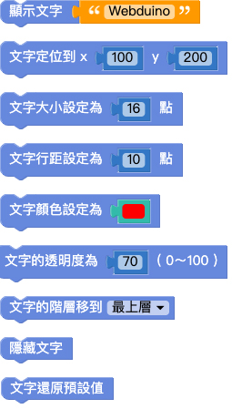

## 顯示文字在小怪獸互動舞台中{{text-object01}}

「顯示文字」積木可以配合文字積木，直接將輸入好的文字顯示在小怪獸互動舞台中。

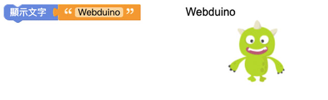
 
## 文字定位{{text-object02}}

「文字定位」積木以小怪獸互動舞台的左下角為原點 (0,0)，透過設定 x、y 的數值，將文字顯示在 xy 座標中的位置。

設定 x 為 100、y 為 200，按下執行，可以看到 Webduino 文字在原點 ( 小怪獸舞台左下角 ) 往右 100、往上 200 的位置。

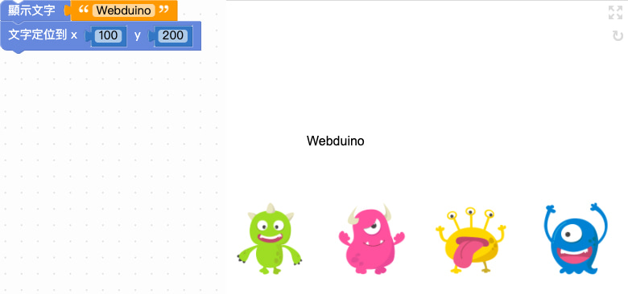

> - 若不使用「文字定位」積木，文字會預設位置在小怪獸互動舞台的*左上角*。
>
> - 因為位置的判定是以 *文字的左上角* 為準，因此當「文字定位」積木設定成 *x 為 0、y 為 0* 時，文字的左上角剛好位在小怪獸舞台的左下角 ( 座標的原點 )，所以畫面中是看不到文字的。

## 文字大小{{text-object03}}

「文字大小」積木可以改變文字的字體大小，預設為 16 點。

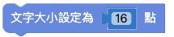

將文字大小改為 50 點，按下執行，可以看到 Webduino 文字變大。

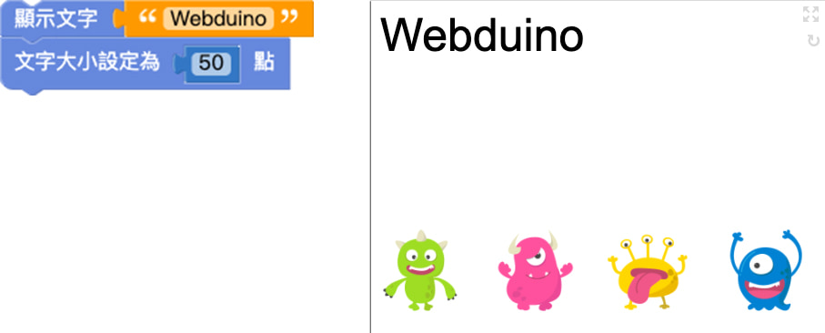

## 文字行距{{text-object04}}

「文字行距」積木可以改變文字的行距，在不使用「文字行距」積木的情況下，預設的行距為 normal。

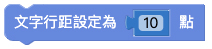

這裡為了展示行距的效果，需要使用「建立字串」積木。  
在 2 個文字積木之間放入「換行」積木。放入「文字行距」積木設定為 50 點，按下執行，就可以看到 2 段文字之間的距離加大了。

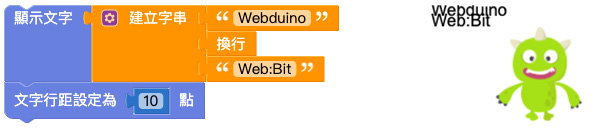

> 行距 normal 會隨著文字大小而改變。
在不改變文字大小的情況下，文字的行距預設為 18 點。

## 文字顏色{{text-object05}}

「文字顏色」積木可以改變文字的顏色，搭配前面介紹的「顏色」積木能夠做出更多的文字顏色變化。

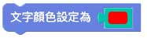

放入「文字顏色」積木，選擇顏色，按下執行後可以看到 Webduino 的文字顏色變成紅色。

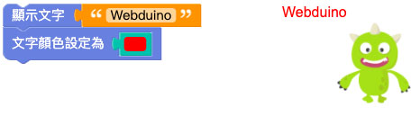

## 文字透明度{{text-object06}}

「文字透明度」積木可以改變文字的透明度，數值可以是 0 ~ 100，0 為完全透明、100 為原始顏色 ( 透明度不變 )。

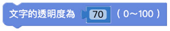

將「文字透明度」積木搭配「文字顏色」積木，設定透明度為 30，按下執行，顯示文字的顏色會比原本顏色較淺。

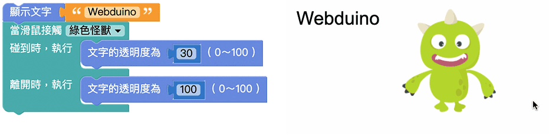

## 文字階層{{text-object07}}

「文字階層」積木能夠控制文字的上下順序位置，決定文字是否會被小怪獸遮蔽。

在預設情況下執行，文字會被小怪獸覆蓋。  
若放入「文字階層」積木並設定*移到最上層*，執行後可以看到文字顯示在小怪獸的上方。

## 隱藏文字{{text-object08}}

「隱藏文字」積木和設定為全透明不同，是直接將設定的文字取消顯示。

先使用「顯示文字」積木設定文字，再後方加上「隱藏文字」積木，按下執行，可以看到原本預設的文字直接被隱藏。

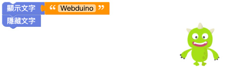

## 文字還原預設值{{text-object09}}

「文字還原預設值」積木可以把前面的程式積木對文字做的任何變化都還原成預設值，

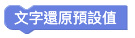

> 文字預設值：
> - 位置：小怪獸舞台左上角
> - 大小：16
> - 行距：normal
> - 顏色：黑色
> - 透明度：100
> - 階層：預設 ( 小怪獸下方 )
> - 隱藏：正常顯示

先將文字做不同的變化設定，讓文字產生不同的樣式變化。

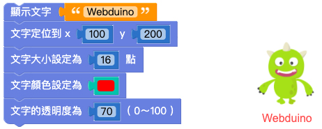

在下方加入「文字還原預設值」積木，按下執行，可以看到剛剛做的變化設定都還原成未做任何變化的文字。

若是在「文字還原預設值」積木下方再加入其它積木，執行後就會再次改變文字樣式。

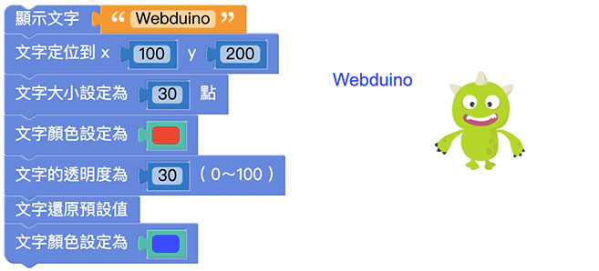
