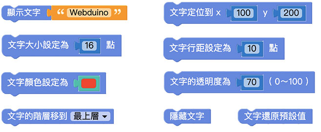

# Web:Bit 擴充功能：文字

前面介紹的 " 基本功能 " 中的文字積木是定義出文字及字串的內容，而 " 擴充功能 " 中的文字積木則是可以改變文字的樣式及位置，並且將文字直接顯示在小怪獸互動舞台中。

## 文字積木清單

文字積木包含樣式 ( 大小、顏色、透明度、行距 )、位置 ( 定位、階層 )，以及顯示、隱藏和還原預設值。

## 顯示文字在小怪獸互動舞台中{{text-object01}}

「顯示文字」積木可以配合文字積木，直接將輸入好的文字顯示在小怪獸互動舞台中。

## 文字定位{{text-object01}}

「文字定位」積木將文字以小怪獸互動舞台的左下角為原點，透過設定 x、y 的數值，將文字顯示在 xy 座標中的位置。

設定 x 為 100、y 為 200，按下執行，可以看到 Webduino 文字在原點往右 100、往上 200
的位置。

> - 若不使用「文字定位」積木，文字會預設位置在小怪獸互動舞台的**左上角**。
>
> - 因為位置的判定是以文字的左上角為準，因此當「文字定位」積木設定成 **x 為 0、y 為 0** 時，文字的左上角剛好位置在小怪獸舞台的左下角 ( 座標的原點 )，所以畫面中是看不到文字的。

## 文字大小{{text-object02}}

「文字大小」積木可以改變文字的大小，預設為 16 點。

