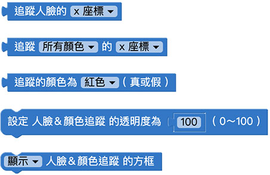
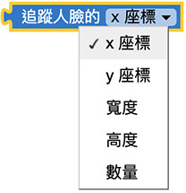
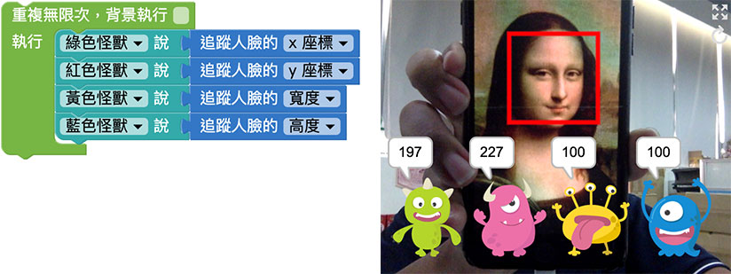
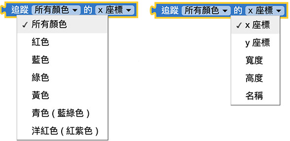

# Web:Bit 擴充功能：人臉＆顏色追蹤

透過 Web:Bit 教育版，啟動電腦攝影機的影像擷取和內建的影像追蹤技術，追蹤「人臉」和「顏色」，藉由追蹤所得到的數值、狀態或座標，實現許多好玩又有創意的應用。

## 人臉＆顏色追蹤 積木清單

人臉＆顏色追蹤的積木包含追蹤人臉的座標、追蹤顏色的座標、追蹤顏色結果的布林值、影像透明度和追蹤方框是否顯示。

## 追蹤人臉的座標{{tracking01}}

「追蹤人臉的座標」積木除了可以追蹤到人臉的 x 和 y 座標，也可以追蹤人臉的寬度和高度，以及畫面中出現幾張人臉。( 注意，追蹤人臉並非辨識人臉 )

追蹤人臉的座標積木必須搭配「重複迴圈」使用，將積木放在重複無限次的迴圈裡，讓小怪獸講出追蹤到人臉的座標和寬度，程式執行後，攝影機就會開始追蹤人臉。

> 注意，程式執行時會需要啟用攝影機的操作權限。

## 追蹤顏色的座標{{tracking02}}

「追蹤顏色的座標」積木可以指定追蹤六種顏色 ( 紅、藍、綠、黃、青、洋紅 )，以及追蹤這些顏色的座標、寬高和名稱。

> 注意，由於攝影機成像和光線的緣故，請在白光下進行測試會較為準確 ( 例如偏紅色光下的藍色物體，透過攝影機解析後可能不會是藍色 )

追蹤顏色的座標積木必須搭配「重複迴圈」使用，將積木放在重複無限次的迴圈裡，讓小怪獸講出追蹤到顏色名稱和座標、寬度，程式執行後，攝影機就會開始追蹤顏色。

> 注意，程式執行時會需要啟用攝影機的操作權限。

## 追蹤的顏色結果{{tracking03}}

「追蹤的顏色結果」積木使用後，會告訴我們現在畫面上「有沒有」追蹤到某個特定顏色，若是有追蹤到會回傳 true 真，否則回傳 false 假。

追蹤的顏色結果的座標積木必須搭配「重複迴圈」使用，將積木放在重複無限次的迴圈裡，接著放入「邏輯」的積木，設定如果偵測到紅色，就讓小怪獸講話，否則就不講話。

> 注意，程式執行時會需要啟用攝影機的操作權限。

## 設定人臉＆顏色追蹤的透明度{{tracking04}}

「設定人臉＆顏色追蹤的透明度」積木可以設定畫面中影片的透明度，0 表示全透明，100 表示不透明。

下圖的例子，將攝影機畫面的透明度設定為 30，就會看見半透明的背景。

## 顯示/隱藏人臉＆顏色追蹤方框{{tracking05}}

「顯示/隱藏人臉＆顏色追蹤方框」積木可以設定畫面中追蹤到人臉或顏色時，是否要顯示追蹤方框。

