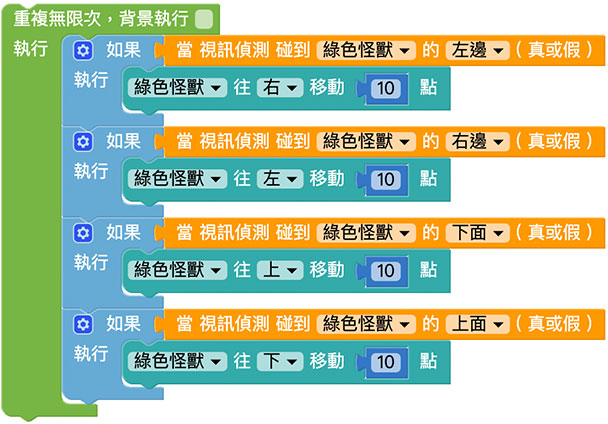

# Web:Bit 視訊偵測

Web:Bit 視訊偵測功能可以透過攝影機，偵測畫面的變化，透過變化的位置進一步和小怪獸互動，輕鬆實現許多和影像有關的虛實整合應用。

## 視訊偵測 積木清單

視訊偵測積木包含一個視訊偵測碰觸的積木，以及攝影機影像透明度的積木。

## 當視訊偵測碰到小怪獸{{vd01}}

「當視訊偵測碰到小怪獸」積木可以偵測是否碰到指定的小怪獸，以及判斷碰到四個邊緣的哪一邊。

當視訊偵測碰到小怪獸的積木必須搭配「重複迴圈」，下圖的例子，將「邏輯」積木放入重複迴圈裡，判斷觸碰到小怪獸左方就往右移，碰到小怪獸右方就往左移，程式執行後，就可以用手在攝影機前觸碰小怪獸讓小怪獸移動。

> - 注意，程式執行時會需要啟用攝影機的操作權限。
>
> - 範例連結：[觸碰小怪獸改變小怪獸位置](https://webbit.webduino.io/blockly/?demo=default#6RLQJ42QOWzqV#_blank)

## 設定視訊偵測透明度{{vd02}}

「設定視訊偵測透明度」積木可以設定畫面中影片的透明度，0 表示全透明，100 表示不透明。

