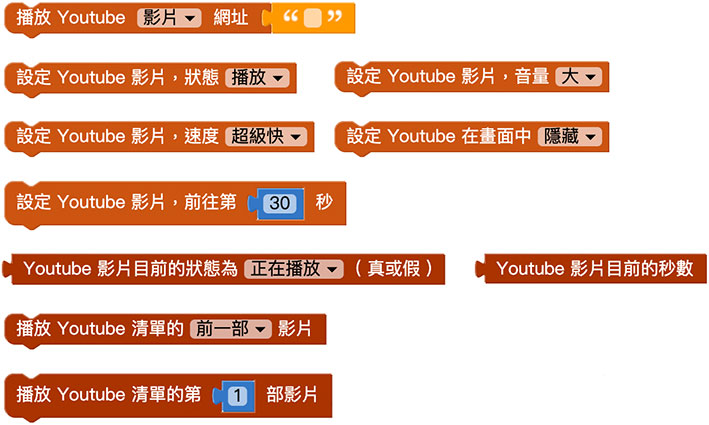
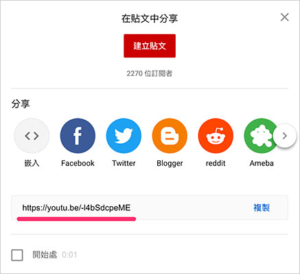
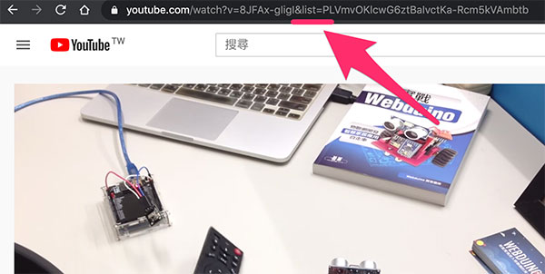
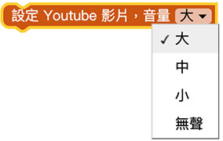
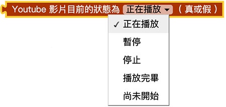

# Web:Bit 擴充功能：Youtube

透過 Web:Bit 教育版，能將物聯網開發板與傳感器結合 Youtube，告別大多數人對於 Youtube 線上瀏覽影片的刻板印象，創造新型的互動模式和物聯網影音效果。

# Youtube 積木清單

Youtube 的積木包含載入 Youtube、播放控制、速度控制、音量控制、影片清單...等 Youtube 大部分功能。

## 播放 Youtube 影片{{youtube01}}

「播放 Youtube 影片」積木可以將 Youtube 的影片或影片清單，載入至怪獸舞台區播放。

前往 Youtube 網站，尋找一支自己喜歡的影片，複製影片的網址。

也可以點選 Youtube 的分享複製網址。

注意，如果網址後方有 list，表示「影片清單」。

複製網址後，回到 Web:Bit 編輯畫面，在畫面中放入「播放 Youtube 影片」的積木，在後方貼上剛剛複製的 Youtube 網址。

程式執行後，小怪獸互動舞台就會開始播放 Youtube 影片。

## 設定 Youtube 狀態{{youtube02}}

「設定 Youtube 狀態」積木可以指定 Youtube 進行播放、暫停或停止。

## 設定 Youtube 音量{{youtube03}}

「設定 Youtube 音量」積木可以設定 Youtube 的播放音量為大、中、小和無聲。

## 設定 Youtube 速度{{youtube04}}

「設定 Youtube 速度」積木可以設定 Youtube 的播放速度為超級快 ( x2 )、快 ( x1.5 )、正常、慢 ( x0.5 ) 和超級慢 ( x0.25 )。

## 隱藏或顯示 Youtube{{youtube05}}

「隱藏或顯示 Youtube」積木可以設定畫面中是否要出現 Youtube 影片，若選擇隱藏，Youtube 還是會播放，也可以控制 Youtube，只是在畫面中看不到。

## 設定 Youtube 前往秒數{{youtube06}}

「設定 Youtube 前往秒數」積木可以指定 Youtube 跳轉到某個秒數，如果大於一分鐘，則要將分鐘成以六十做秒數換算。

## 取得 Youtube 播放狀態{{youtube07}}

載入 Youtube 之後，可以透過「取得 Youtube 播放狀態」積木，取得目前 Youtube 播放狀態的「布林值」( true 或 false )，進一步搭配邏輯判斷做更多變化。

## 取得 Youtube 正在播放的秒數{{youtube08}}

載入 Youtube 之後，可以透過「取得 Youtube 正在播放的秒數」積木，取得目前 Youtube 播放的秒數。

## 設定 Youtube 播放清單{{youtube09}}

「設定 Youtube 播放清單」積木，可以指定 Youtube 播放清單中的前一部影片或後一部影片。

## 設定 Youtube 播放清單第幾部影片{{youtube10}}

「設定 Youtube 播放清單第幾部影片」積木，可以指定 Youtube 播放清單中的第幾部影片。

## 透過 Web:Bit 控制 Youtube 影片{{youtube11}}

透過 Youtube 相關積木，能將 Web:Bit 開發板設計成 Youtube 的遙控器，首先放入 Web:Bit 開發板積木，接著放入「播放 Youtube 影片」積木，輸入欲播放的影片網址，接著放入按鈕開關的積木，按下 A 時播放影片，按下 B 則暫停影片，A 和 B 同時按下就停止影片，程式執行後，就可以透過 Web:Bit 開發板操控 Youtube 的播放。

