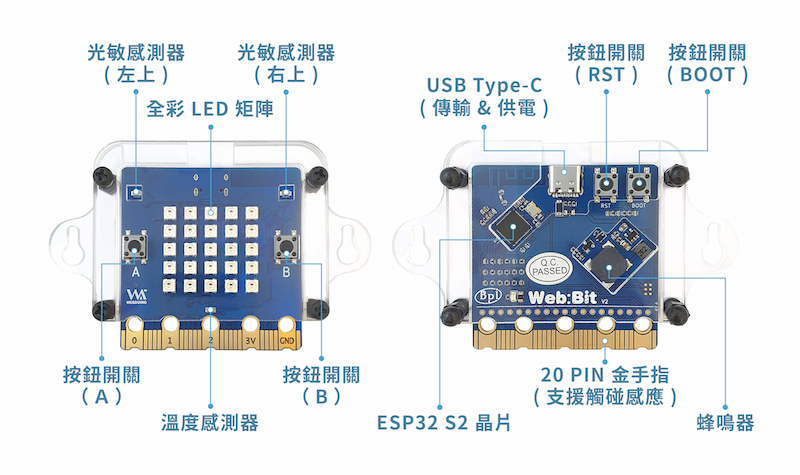
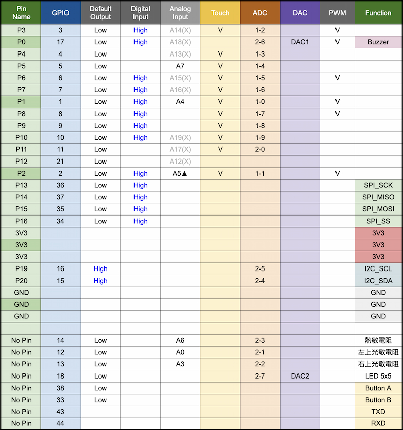
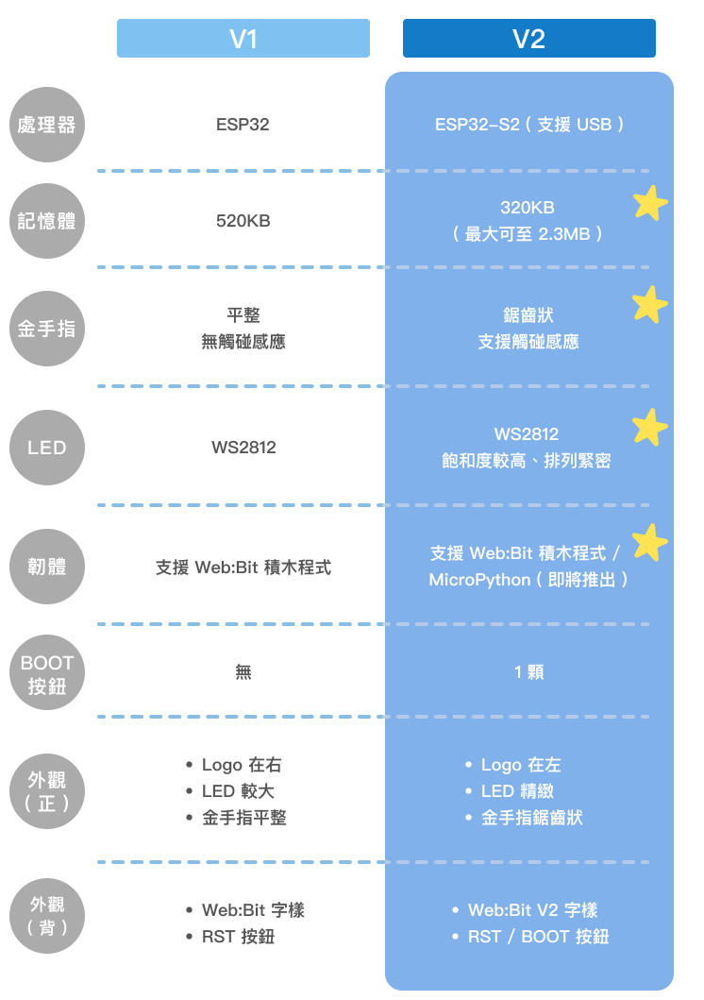

# Web:Bit 教育版

因應落實運算思維與資訊科技教育，Webduino 於 2019 年推出了 Web:Bit 教育版，Web:Bit 教育版是基於 Webduino Bit 所延伸的教學版本，主要分成「編輯器」和「開發板」兩個部分，藉由軟硬體的整合，可以學習程式設計、數學邏輯和網路知識，也能充分感受物聯網的趣味和便利，並從中獲得創造性思考、編程與合作分工的體驗。

> - Web:Bit 教育版編輯器*目前所有功能全部免費*，如果需要搭配硬體實作更多創意，則需*額外購買 Web:Bit 硬體開發板*，就能進行軟硬整合的搭配應用。
>
> - 購買 Web:Bit：[Webduino 線上商店](https://store.webduino.io/products/webduino-bit#_blank)

## Web:Bit 編輯器{{software}}

Web:Bit 教育版的編輯器分成網頁版和安裝版兩種，兩個版本介面與功能幾乎完全相同，可以依據不同的需求採用不同的版本，相關功能請繼續參考 [編輯器 ( 安裝版工具列 ) ](info/toolbar.html) 和 [編輯器 ( 操作介面 )](info/interface.html) 兩篇教學。

### 1、網頁版

網頁版不需要安裝任何軟體，只要電腦有網路，透過瀏覽器打開指定網頁就能運作，不論是 Windows 或 Mac 都能運作，適合快速體驗的使用者。( 網頁版限定 Google Chrome 瀏覽器 )  

網頁版即日起可透過 USB 控制開發板囉！使用前，請先更新開發板韌體，詳細操作方式請參考教學文 [Web:Bit 開發板](https://webbit.webduino.io/tutorials/doc/zh-tw/education/board/board.html)。

> 網頁版網址：[https://webbit.webduino.io](https://webbit.webduino.io#_blank)

### 2、安裝版

安裝版目前只提供 Windows 版本，介面和操作方式和網頁版完全相同，差別在於安裝版需要下載 Web:Bit 的執行檔進行安裝。

> - 參考資源：[編輯器 ( 安裝版工具列 ) ](info/toolbar.html)
> - 安裝版下載：[WebBitSetup.exe](https://ota.webduino.io/WebBitInstaller/WebBitSetup.exe#_blank)

## Web:Bit V2 開發板

Web:Bit 是 Webduino 最新的開發板，除了原本的功能一應俱全 ( Wi-Fi 操控、多裝置串連、協同作業...等 )，更內建許多新的元件和傳感器、搭配內建 2.4G Wi-Fi 功能，是目前市面上最高效能、最穩定以及最通用的產品之一。

> - 如欲操控 Web:Bit 開發板，請先閱讀 [硬體 ( 初始化與更新 )](info/setup.html) 一文，進行相關網路設定。
>
> - 購買 Web:Bit 請至 [Webduino 線上商店](https://store.webduino.io/products/webduino-bit#_blank)

### 硬體規格

Web:Bit v2 開發板長 5 公分寬 5 公分，重量約 10~12 公克，除了下方 20 Pin 的「金手指介面」，更內建一個 25 顆全彩 LED 燈的矩陣，兩個光敏電阻、兩個按鈕開關、一個溫度感應電阻，以及一個蜂鳴器。

- 全彩 LED 矩陣：( GPIO 18 )
- 光敏感應器：左上 ( GPIO 12 )、右上 ( GPIO 13 )
- 按鈕開關：按鈕 A P5 ( GPIO 5 )、按鈕 B P11 ( GPIO 11 )
- 溫度感應器：( GPIO 14 )
- 蜂鳴器：P0 ( GPIO 17 )

### Web:Bit V2 腳位列表

## Web:Bit V1 開發板

### 硬體規格

Web:Bit 開發板長 5 公分寬 5 公分，重量約 10~12 公克，除了下方 20 Pin 的「金手指介面」，更內建一個 25 顆全彩 LED 燈的矩陣，兩個光敏電阻、兩個按鈕開關、一個溫度感應電阻 一個蜂鳴器和一個九軸感測器 ( 三軸加速度、三軸陀螺儀與三軸磁力指南針 )。

- 全彩 LED 矩陣：A10 ( GPIO 4 )
- 光敏感應器：左上 A0 ( GPIO 36 )、右上 A3 ( GPIO 39 )
- 按鈕開關：按鈕 A P5 ( GPIO 35 )、按鈕 B P11 ( GPIO 27 )
- 溫度感應器：A6 ( GPIO 34 )
- 蜂鳴器：P0 ( GPIO 25 )
- 九軸感測器 MPU-9250：P20 ( GPIO 21 )、P19 ( GPIO 22 )

### 腳位列表

## V1 與 V2 比較

