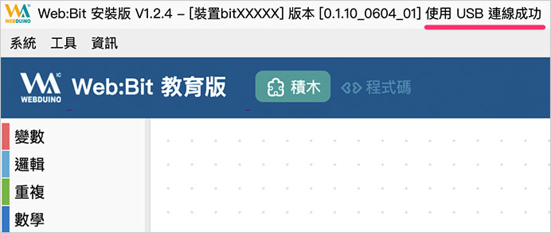
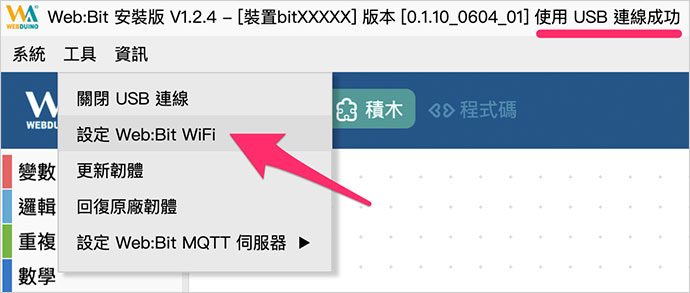
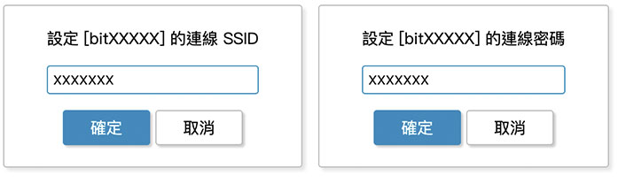
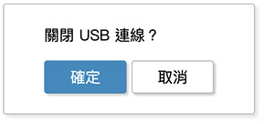
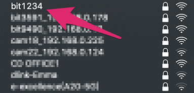
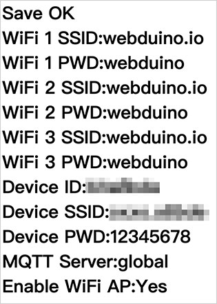

# Web:Bit 硬體開發板 ( 初始化設定 )

使用 Web:Bit 之前，最重要的就是進行初始化設定，初始化設定的目的在於讓 Web:Bit 開發板可以自動上網 ( Internet )，有了初始化設定，我們也能夠自訂開發板的顯示名稱和密碼，更可以連上 internet 進行遠端更新。

>- 需要透過「Wi-Fi」連線控制開發板，才需要先進行初始化設定，如果單純使用「USB 操控」，則可以不進行初始化設定。
>
>- 在進行初始化過程中，如果遇到無法連上網路的問題，請參考 [常見問題：無法連線到 Wi-Fi 怎麼辦？](../../faq/wifi.html#connect1#_blank)

## 初始化方法 1：使用安裝版進行初始化{{step1}}

如果是使用安裝版 ( 不清楚什麼是安裝版，請參考 [Web:Bit 編輯器](../index.html#software) )，可以直接透過安裝版的工具，按照下列步驟進行初始化設定。

> 安裝版下載：[WebBitSetup.exe](https://ota.webduino.io/WebBitInstaller/WebBitSetup.exe#_blank)

<iframe width="560" height="315" src="https://www.youtube.com/embed/214xij27_78" title="YouTube video player" frameborder="0" allow="accelerometer; autoplay; clipboard-write; encrypted-media; gyroscope; picture-in-picture" allowfullscreen></iframe>

### 步驟 1、開啟工具列

打開安裝版後，最上方會出現安裝版的「版本號碼」以及「掃描 USB 裝置」的提示訊息，此時可以將 Web:Bit 硬體開發板使用 USB 線連接電腦，讓軟體進行掃描。

掃描到開發板後，上方會出現 Web:Bit 開發板的 *Device ID、版本號碼以及連線成功的文字提示*。

**如果一直出現「掃描 USB 裝置」，沒有出現連線成功的訊息**，表示 Web:Bit 開發板的韌體可能有問題 ( 程式錯誤或自行寫入其他韌體 )，此時可以用滑鼠選擇「*工具 > 回復原廠韌體*」進行韌體更新。( 已經出現連線成功文字訊息可忽略此步驟，*強制更新韌體可能會讓 Device ID 不同*，請特別注意！ )

當開發板透過 USB 連線成功後，用滑鼠選擇「*工具 > 設定 Web:Bit WiFi*」，即可開始進行 WiFi 初始化更新。

### 步驟 2、設定 Wi-Fi SSID 與密碼

點選設定 WiFi 後，會彈出一個對話視窗，詢問欲連線的 WiFi 基地台 SSID 名稱和連線密碼，請填入所在場所例如：公司、學校或家裡的 Wi-Fi 基地台的帳號和密碼。

設定完成後，會彈出一個對話視窗，詢問是否關閉 USB 連線，如果選擇「確定」，開發板就會透過剛剛設定的 Wi-Fi SSID 與密碼，連線到指定的 Wi-Fi 基地台，如果選擇「取消」，就會關閉 Wi-Fi 連線功能，僅能使用 USB 連線操作。

若選擇關閉 USB 連線功能，*Web:Bit 開發板會進入重啟並閃爍紅燈，當紅燈熄滅且綠燈亮起一次之後，表示 Bit 開發板已經成功連結上家裡或環境內的 WiFi 基地台*。( 若紅燈持續閃爍或恆亮，請重新進行步驟 2，若紅燈閃完後亮起「藍燈」而不是綠燈，表示已有新版本可以進行下載更新，請參考 [硬體開發板 ( 更新韌體 )](ota.html) 一文。 )

> *在 Wi-Fi 連線操控的狀態下，可以使用遠端操控* ( 例如將開發板接行動電源遠離電腦、在公司或學校控制家裡的開發板 )，*透過 USB 操控必須將開發板連接控制的電腦*，雖然說無法遠距操控，但可以在沒有 Wi-Fi 的情形下進行操作體驗。

## 初始化方法 2：連線到開發板進行初始化{{step2}}

如果無法使用安裝版初始化，也可以透過有 Wi-Fi 連線功能的電腦或行動裝置，連接到開發板進行初始化設定，相關步驟如下所示：

<iframe width="560" height="315" src="https://www.youtube.com/embed/jRaZllkLE2g" title="YouTube video player" frameborder="0" allow="accelerometer; autoplay; clipboard-write; encrypted-media; gyroscope; picture-in-picture" allowfullscreen></iframe>

### 步驟 1、接上電源，輸入 WiFi 帳號密碼連線

把 Web:Bit 接上電源，一開始在開發板正面的全彩 LED 點矩陣，會透過跑馬燈顯示一串文字 ( *預設是 bit 三個英文字加上四個數字* )，這串文字對應到電腦或行動裝置 WiFi 搜尋裡的 SSID 名稱，例如顯示 bit1234，在 WiFi 搜尋中就會看到 bit1234 的名稱，**注意，這串文字「不是」操控開發板的 Device ID，是識別用的 SSID**！

由於開發板尚未初始化設定完成，也就無法連線至區域網路，所以一開始*會閃紅燈，或者紅燈恆亮*。這時請準備一台具備 WiFi 功能的電腦、筆電或行動裝置，使用這台裝置進行 Wi-Fi 搜尋剛剛看到為「bitXXXX」的裝置 ( 以上述的例子就是搜尋 bit1234 )，找到該裝置後，輸入預設密碼 *12345678*，進行連線。

### 步驟 2、設定 WiFi 帳號密碼與顯示名稱

*確認連線成功*後，打開瀏覽器 ( 建議使用 Chrome )，網址列輸入 192.168.4.1 連線到 Bit 開發板的設定畫面，畫面中包含以下幾種設定：

|分類|設定|說明|
|--|--|--|
|Wi-Fi|**WiFi SSID、PWD**|必須至少填入一組 Wi-Fi 基地台 SSID 和密碼，表示開發板要連接哪個 Wi-Fi 基地台，最多可填入三組，依據不同的環境自動切換。|
|Device|**Device ID**|每塊開發板的唯一識別代碼，目前版本預設都是短 ID，如果看到 ID 為 18 碼的長 ID，可以點擊 Shorten the ID 的按鈕更換為短 ID，或進行遠端更新自動更換為「短 ID」( *注意！遠端更新需要設定 Web:Bit 的網路連線，在網路連線狀態下才能更換*，參考 [Web:Bit 硬體 ( 更新韌體 )](ota.html) )|
|Device|**Device SSID、PWD**|裝置*在 WiFi 搜尋中所顯示的名稱和密碼*，若不填寫會自動產生 SSID 以及預設密碼 12345678。|
|Device|**MQTT Server**|開發板要連接的伺服器，預設 Global，中國地區請選擇 China。|
|Device|**Enable WiFi AP**|是否永遠在 Wi-Fi 搜尋清單中可以看見開發板，預設持續顯示，可選擇三分鐘後在搜尋清單裡隱藏。|
|Info|-|開發板相關資訊，包含網路卡卡號、Wi-Fi 連線以及版本資訊。|

設定完成後按下 SUBMIT 儲存，出現 SAVE OK 的字樣表示儲存成功，此時 Web:Bit 開發板會重啟並閃爍紅燈，當紅燈熄滅且綠燈亮起一次之後，表示 Bit 開發板已經成功連結上家裡或環境內的 WiFi 基地台。( 若紅燈持續閃爍或恆亮，請移除電源，重新操作步驟 1 與步驟 2，若紅燈閃完後亮起「藍燈」而不是綠燈，表示已有新版本可以進行下載更新，請參考 [Web:Bit 更新韌體](ota.html) 一文。 )

