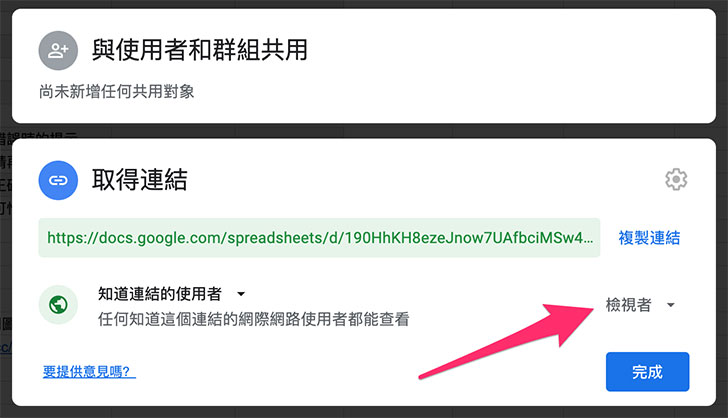

# 英語會話 ( 使用 Google 試算表 )

在 Webduino 凱比物聯網教室的擴充功能裡，可以自己設計英語會話的遊戲與應用情境，部署到凱比機器人之後，產生與眾不同的互動效果，這篇文章將會介紹透過 Google 試算表的方法設定英語會話。

## 使用英語會話 Google 試算表積木

使用電腦的 Chrome 瀏覽器開啟凱比物聯網教室，輸入凱比機器人的 ID 以及密碼登入。

> - 凱比物聯網教室：[https://kebbi.webduino.io](https://kebbi.webduino.io#_blank)
>
> - 延伸閱讀：[凱比物聯網教室系列教學](../index.html)

登入後，進入 Web:Bit 程式積木。

點選右上方「擴充」選單，開啟擴充功能，畫面往下拉，點選「英語會話」，就可以將英語會話的擴充積木加入積木清單。

關閉擴充功能，回到編輯畫面，在左側積木清單的擴充功能裡，可以看到「英語會話」的積木選項，裡頭的積木除了第一塊「載入 Google 試算表關卡模板」是獨立運作，其他的積木則必須交互配合使用，就能做出互動式的英語會話情境。

將「載入 Google 試算表關卡模板」放入編輯畫面中，這塊積木將會載入英語會話的 Google 試算表模板，透過試算表的設定，就能自動產生對應的互動關卡。

## 載入模板

在 Chrome 瀏覽器中開新分頁，使用自己的 Google 帳號登入 Google 雲端硬碟，登入後，打開英語會話  Google 試算表模板。

> 點選開啟：[英語會話 Google 次算表模板](https://bit.ly/kebbi-english)

點選左上方「檔案」，選擇「建立副本」，將試算表模板建立一個副本到自己的雲端硬碟裡，這時瀏覽器也會自動開啟這個副本。

## Google 試算表權限設定

接著編輯模版副本的權限，點選右上方的「共用」，修改試算表的權限為「知道連結的人使用者」都是「檢視者」，按下完成儲存設定。

## 英語會話模板設定

英語會話的試算表模板，第一個 setting 工作表表示「*英語會話關卡設定*」，包含了標題、提示、隨機、錯誤嘗試、分數、等級、語速和過關圖片。( *有紅色星號的欄位代表「可以修改」*的設定 )

第二個 script 工作表表示「*英語會話的對話內容*」，每一組對話有一個深灰色的的「*標題*」，執行後不會顯示在畫面中，目的只是作為區隔不同組別的對話使用，。( *有紅色星號的欄位代表「可以修改」*的設定 )

每一組對話也分別包含了「*背景圖片、四種角色的設定和對話內容*」，背景圖片目前只支援網路圖片，只要有圖片的網址，將網址複製貼上在這個欄位內，執行後就會顯示在畫面中，四種角色的設定分別可以設定角色是「*computer 電腦、user 使用者或是不顯示*」，設定為 computer 就會由電腦自動發音，設定為 user 使用者就由使用者進行朗讀做語音識別判讀，設定無，則不會顯示，而角色圖片也是使用網路圖片，只要有角色圖片網址，執行後就會在畫面中顯示該角色。( *有紅色星號的欄位代表「可以修改」*的設定 )

角色對話可以透過角色的編號，來指定哪個角色要講話或進行朗讀測驗。( *有紅色星號的欄位代表「可以修改」*的設定 )

如果要設定兩組以上的對話，只要複製上一組的對話內容，貼到最下方即可。

## 執行英語會話

英語會話模板設計完成後，複製這份試算表的網址，接著回到 Webduino 物聯網教室的 Web:Bit 程式積木，放入「載入 Google 試算表關卡模板」積木，在模板的網址區域貼上試算表的網址。

按下右上方的「執行」按鈕，就會看見右下角的「怪獸舞台區域」，變成英語會話的關卡，點擊右上角全螢幕的符號，變成全螢幕就可進行會話互動。

如果要將英語會話關卡部署到凱比機器人，將滑鼠移到右上方的「更多」選單，點選「部署到機器人」，輸入這個程式的專案名稱，以及登入時的密碼，就能將英語會話的程式部署到凱比機器人。

