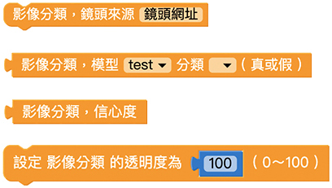

# 影像分類

擴充功能中的影像分類功能可以使用程式積木，配合影像訓練過的模型來辨識偵測到的物體，達到影像辨識的效果。首先列出影像分類各積木的功能，再來會介紹影像分類的程式操作步驟。

## 影像分類積木清單

影像分類積木包含鏡頭來源、模型分類、信心度、透明度等積木。

## 鏡頭來源

「鏡頭來源」積木可以選擇使用鏡頭訊號的來源，在積木內填入使用的鏡頭網址，就能夠控制鏡頭的來源。

若是使用裝置上的鏡頭則不需使用「鏡頭來源」積木。

## 模型分類

「模型分類」積木表示辨識到的影像是某模型中的某分類。
將影像訓練建立的模型和分類名稱設定到積木中，讓程式判斷是否辨識為真，搭配其它積木能夠再執行後續動作。

## 信心度

「信心度」積木能夠讀取出影像辨識的信心度數值，若信心度越高，代表偵測錯誤的可能越低。

> 影像訓練辨識的結果會落在一個區間範圍內，若信心度為 90%，代表有 90% 的機率真正的結果會落在這個區間範圍內。

## 透明度

「透明度」積木可以改變影像的透明度，數值可以是 0 ~ 100，0 為完全透明、100 為原始顏色 ( 透明度不變 )。

## 影像分類操作

這裡開始進行影像分類的程式教學。  

為了要在辨識的時候顯示信心度，使用「小怪獸講話」積木加上「信心度」積木，讓其中一隻小怪獸說出信心度的數值。

再來要撰寫影像分類的邏輯程式，這裡的例子中會有 4 種辨識結果，包含 A、B、C 和 都不是。

使用「如果執行」積木，後方加入「模型分類」積木，讓影像分類成功時進行下一動作。這裡的例子是讓小怪獸說出辨識結果，因此在「如果」、「否則如果」分別設定 3 種辨識結果，並且讓小怪獸說出。  
因為辨識的結果有可能都不是分類的影像，所以在「否則」後方設定小怪獸說出「都不是」。

完成影像分類的邏輯程式後，就能夠正常進行辨識，但是這樣的程式代表只能進行判斷一次，所以需要在最外側增加一個「重複」積木，這裡選用「無限重複」積木，可以讓程式不斷辨識影像，並顯示辨識結果。

完成之後按下執行，可以看到
