# 影像訓練

在影像訓練的功能中，我們可以建立出自己的影像分類和影像模型，透過對這些影像的特徵分析，可以辨識出鏡頭捕捉的影像是屬於哪項物品。

## 影像訓練流程

進入凱比物聯網教室後，選擇「Webduino 影像訓練」，進入影像訓練頁面。

在頁面中可以看到左側有「分類」和「模型」兩個選項，分別為建立圖片庫和執行影像辨識功能。

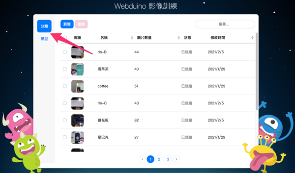

進行影像辨識的流程中，需要先分別建立影像分類和模型，接著將分類放入模型中，就可以使用模型來進行影像辨識了。

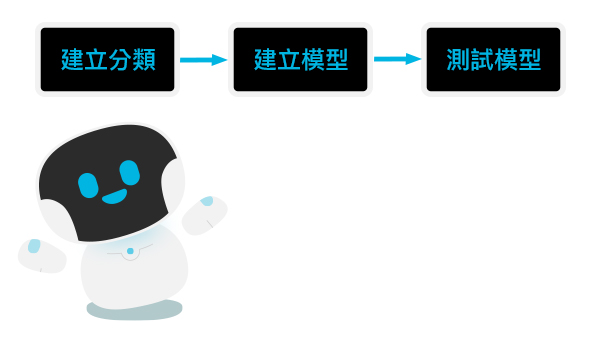

## 建立影像分類 

首先在左側的側邊列選擇「分類」。  
畫面中的列表是用來存放建立過的分類，可以從名稱、圖片數量、修改時間的排序和搜尋功能來找到已建立的分類。

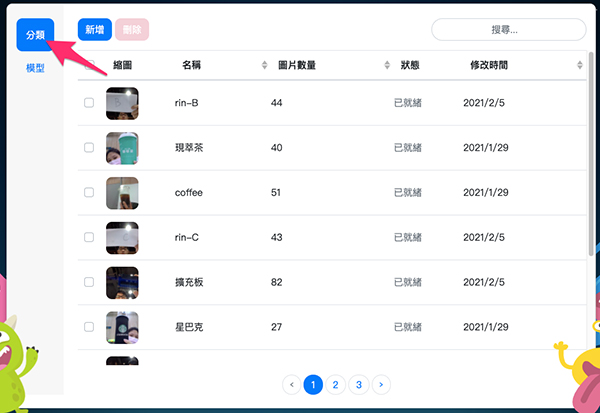

### 建立分類

按下藍色的「新增」按鈕，會跳出「建立分類」的視窗，接著輸入分類名稱和選擇分享狀態，「私人分類」代表只有自己的帳號才能使用此分類；「公開分類」代表所有人都可以使用。  

再來選擇影像上傳方式，可以從 4 種不同方式上傳影像，分別是：
- 上傳影像：從自己的電腦中上傳影像，可選擇上傳影像檔或 zip 檔。
- 攝影鏡頭：使用裝置的攝影鏡頭拍攝影像。
- 既有分類：從自己的分類列表中選擇多個分類，建立成一個新的分類。
- 公開分類：使用他人建立的公開分類來建立分類。

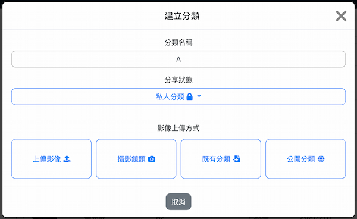

建立完成後，就可以在分類列表中看到剛剛建立的分類了。

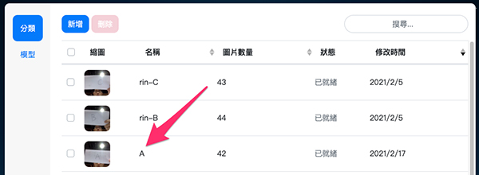

### 使用攝影鏡頭上傳影像

如果選擇「攝影鏡頭」，會進入到擷取影像的頁面，這裡需要使用裝置相機，相機權限選擇「允許」。  
等到相機畫面出現就可以按下綠色「擷取影像」按鈕來拍照，移動物品來讓鏡頭擷取不同角度和位置的影像，能夠提高準確度。一般來說，擷取影像的數量越多，影像辨識的準確度會越高。  
擷取完影像後，點擊「建立分類」按鈕，就可以在分類列表中看到剛剛建立的分類了。

> 按下**紅色「清除影像」按鈕**後，會將擷取的影像**全部刪除**，點擊之前請先注意！

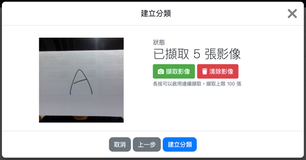

### 修改分類

在分類列表中點選其中一項分類，會跳出「修改分類」的視窗，在這裡可以修改分類的名稱和分享狀態，也可以透過 4 種影像上傳方式新增分類中的影像。修改完成後點擊「修改並儲存」按鈕，就可以完成修改。

> 在修改分類功能中，只能增加影像，無法刪除分類中的影像。

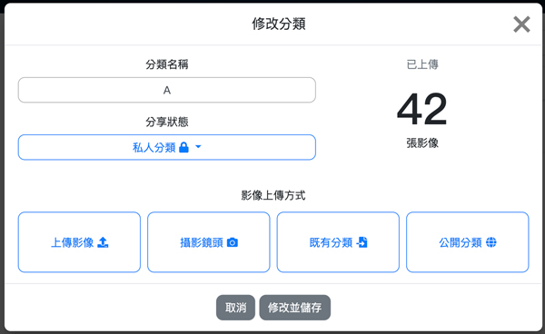

### 刪除分類

在分類列表中，可以勾選多個分類後刪除。

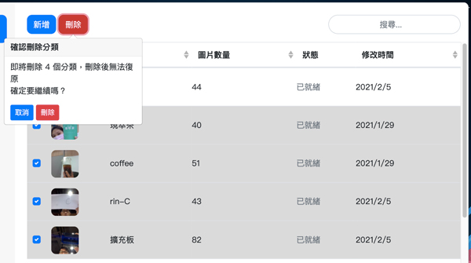

## 建立影像模型

建立完分類後，在左側的側邊列選擇「模型」。  
畫面中的列表是用來存放建立過的模型，可以從名稱、修改時間的排序和搜尋功能來找到已建立的模型。

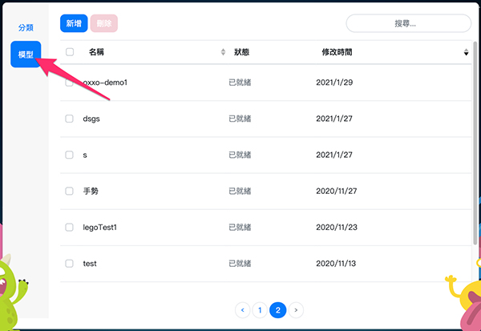

### 新增模型

按下藍色的「新增」按鈕，會跳出「新增模型」的視窗，接著輸入模型名稱和選擇分享狀態，「私人模型」代表只有自己的帳號才能使用此模型；「公開模型」代表所有人都可以使用。 

再來選擇模型建立方式，可以從 3 種不同方式建立模型，分別是：
- 挑選分類：從分類列表中挑選建立過的分類來建立模型。 *( 分類數量需為 2 個以上 )*
- 複製既有模型：從模型列表中複製曾經建立過模型。
- 複製公開模型：複製他人建立的公開模型。

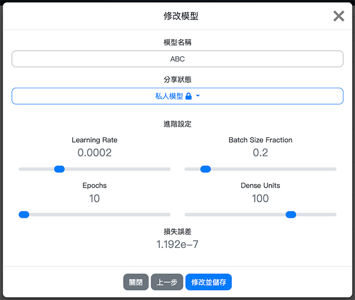

點選「建立模型」後，就可以在模型列表中看到剛剛建立的模型了。

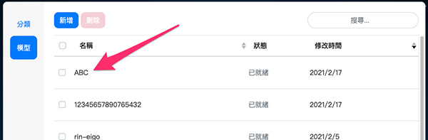

> 若模型訓練等待過久，讓頁面重新整理，就可以看到建立的模型訓練完成了。

### 挑選分類

如果使用「挑選分類」來建立模型，需要選擇 2 個以上的分類放入模型中，才能辨識出不同的結果。  

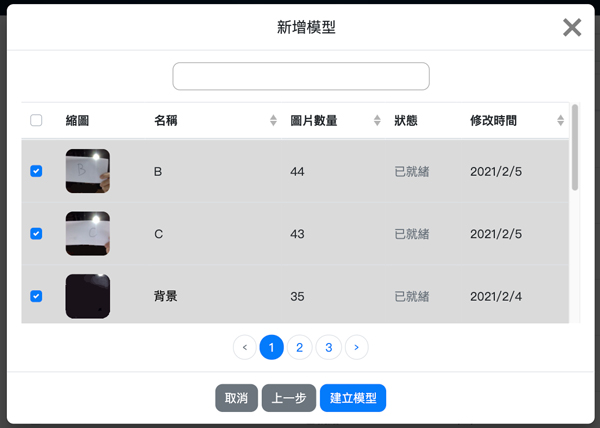

> 建議多放入一個*背景*分類，因為當沒有偵測到物件時，辨識結果會顯示為其中一項分類。如果有放入*背景*分類，就能正常顯示辨識結果為背景。

### 修改模型

在模型列表中點選其中一項模型，會跳出「修改模型」的視窗，選擇「修改模型」進入下個頁面。  
在這裡可以修改模型的名稱和分享狀態，也可以修改進階設定中的影像辨識數值。修改完成後點擊「修改並儲存」按鈕，就可以完成修改。

>- 如果點選的是複製的模型，會無法使用「修改模型」功能。
>
>- 調整進階設定中的影像辨識數值會影響辨識的誤差和信心度，一般建議使用預設的數值。

### 刪除模型

在模型列表中，可以勾選多個模型後刪除。

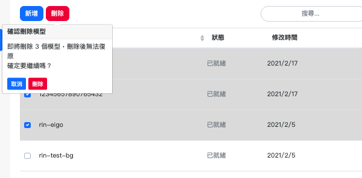

## 測試模型

當模型建立完成後，就可以使用「測試模型」功能來進行影像辨識了。  
從模型列表中點選欲使用的模型，會跳出「修改模型」的視窗，選擇「測試模型」進入「測試模型」頁面，就可以開始進行影像辨識了。  
開始辨識後，會顯示偵測到的辨識結果和信心度，若信心度百分比越高，代表偵測錯誤的可能性越低。

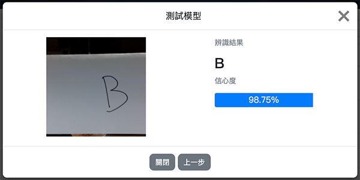

>- 辨識結果會因為場地的光線、背景、裝置鏡頭的角度而影響，因此對同一目標的辨識結果和信心度都會不同。
>
>- 因為影像訓練辨識的結果會落在一個區間範圍內，若信心度為 90%，代表有 90% 的機率真正的結果會落在這個區間範圍內。

123