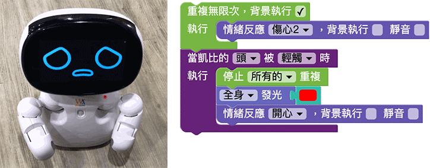

# 感應

凱比機器人的頭、肚子和雙手，都各有觸摸感應器，能夠感應碰觸的動作，並且依據程式邏輯，在碰觸的當下產生對應的動作、聲音或表情回饋，除了觸摸感應器，凱比機器人也可以偵測是否有人體紅外線變化，輕鬆做出感應是否有人經過的效果。

## 感應積木清單

感應積木有兩種，分別是觸碰感應以及人體紅外線感應。

## 觸碰機器人讓機器人講話

連續放入「當凱比的頭、右手、左手」三塊積木，分別放入說話的積木，當摸頭的時候講出被摸頭，摸右手說出被摸右手，摸左手講出被摸左手，程式部署到機器人執行後，用手觸摸凱比機器人，就會聽見凱比機器人講話。

## 碰觸機器人改變機器人表情

將機器人難過的表情放在重複無限次的迴圈裡，讓機器人可以重複無限次的難過，將迴圈設定為背景執行 ( 才不會影響下方程式運作 )，下方放入感應到觸碰機器人頭的程式，當觸碰機器人的頭，就停止迴圈，並將機器人的表情更改為開心，同時亮起紅燈，部署程式執行後，就可以用手觸摸難過的機器人頭部，機器人就會開心起來囉！

> 相關教學請參考：[重複](../../education/basic/loop.html)

