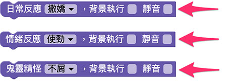
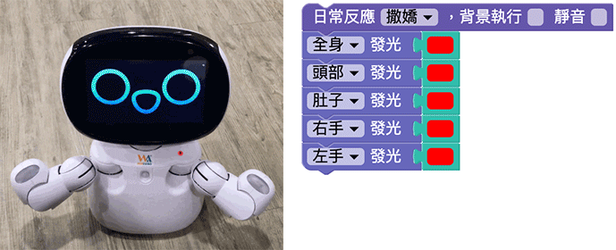
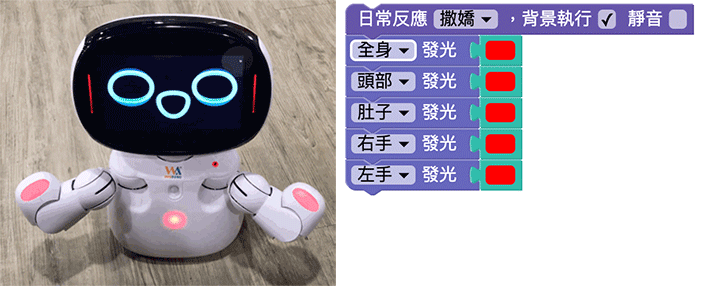

# 表情

凱比機器人的臉部是一個全彩螢幕，透過螢幕的表現，能夠展示許多豐富的情緒和表情變化，藉由表情的展現，讓機器人更具有人類感性的一面。

## 表情積木清單

表情積木主要分成三種，分別是日常反應、情緒反應和鬼靈精怪。

## 背景執行與靜音

表情積木除了可以指定表情，後方有一個「背景執行」和「靜音」的選項，若勾選背景執行，則該積木會獨立運作，不影響後續積木，如果勾選靜音，則機器人產生表情時不會發出音效。

## 機器人表情和燈光搭配

下方的例子在沒有勾選背景的狀況下，部署到機器人執行後，機器人會先出現撒嬌的表情，接著再把身體的燈光變成紅色。

如果有勾選背景執行，部署到機器人執行後，就會在撒嬌的同時呈現紅色燈光。

