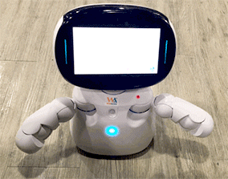
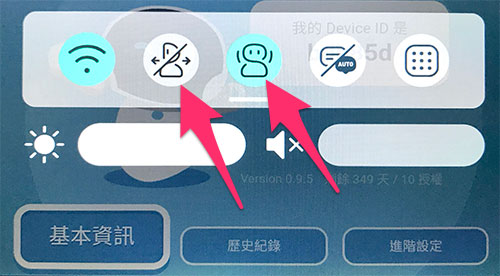

# 肢體

凱比機器人包含脖子、肩膀、手臂、手肘等多個伺服馬達關節，透過關節的組合能產生各種不同的肢體動作。

## 肢體積木清單

肢體積木包含一個下拉選單，有頭部 ( 上下左右 )、肩膀 ( 內外轉 )、肩膀 ( 上下抬 )、手臂和手肘的選項，透過角度欄位設定旋轉的角度，後方文字提示角度最大值和最小值的區間。

## 編輯一段自訂的肢體動作

所有肢體的旋轉，都會同時發生，因此可以透過一連串的組合，實現不同的肢體動作，首先將頭部上下移動的積木，放在重複無限次的迴圈內，並將重複無限次的迴圈勾選「*背景執行*」( 如此才不會影響到後續的程式 )，接著將手臂側抬的積木放在另外一個重複無限次的迴圈裡，同樣也勾選「*背景執行*」。

部署到機器人開始執行後，就會看見機器人不斷地點頭以及揮手。

如果順利部署但是機器人不會動，可以檢查機器人的設定是否將動作關閉了。( 手指在凱比臉上從上往下滑動展開選單 )

