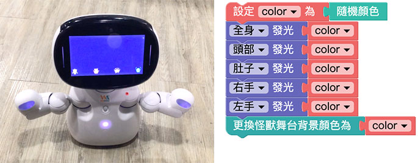

# 燈光

凱比機器人的臉、雙手以及肚子上都有可以展示七彩光線的 LED 燈，透過積木程式的操控，就能產生五顏六色的變化。

## 燈光積木清單

燈光積木共有三種，一種是單純指定亮燈顏色，一種是雙手的呼吸燈 ( 漸強漸弱交替 )，一種是關燈。

## 機器人展示同一種顏色

如果要讓機器人展示同一種顏色，可以使用「變數」的積木承接某一種顏色 ( 這樣做可以不需要不斷的做顏色設定 )，再把變數套用到頭、肚子、雙手的燈光積木裡，最後再放入怪獸舞台畫面的顏色，部署到機器人執行之後，就會看見機器人呈現隨機顏色。

> 相關教學請參考：[變數](../../education/basic/variables.html)、[顏色](../../education/basic/color.html)

## 機器人七彩顏色閃爍

一開始先設定機器人的動作，接著延伸上方的顏色範例，將積木放到「重複無限次」的迴圈裡，加上等待一秒的積木，部署到機器人執行之後，就會看見機器人每隔 0.5 秒呈現不同的隨機顏色。

> 相關教學請參考：[重複](../../education/basic/loop.html)

