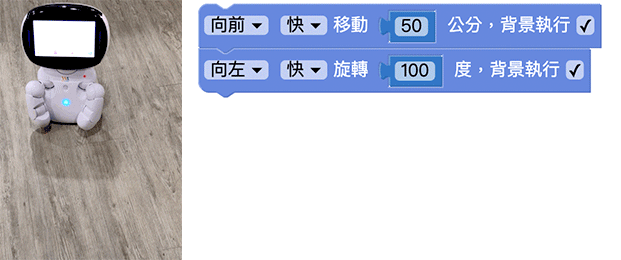
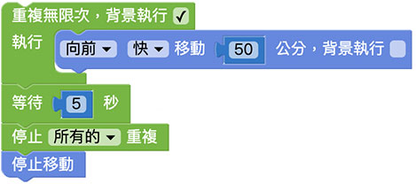

# 移動

透過移動相關的積木，能夠讓凱比機器人前進後退或左轉右轉，進一步也可透過網路廣播，讓小怪獸、鍵盤或手機都能遙控機器人。

## 移動積木清單

移動積木包含移動、旋轉、停止移動和停止旋轉四種。

## 背景執行

移動和旋轉的積木，除了可以設定方向、速度、距離或角度，後方有一個「背景執行」的選項。

以下方的例子而言，如果沒有勾選，程式部署執行後，機器人會先移動 100 公分，移動完畢之後再旋轉 100 度。

如果有勾選，程式部署執行後，機器人則會一邊移動一邊旋轉。

## 移動 5 秒後停止

將移動的積木放在「重複無限次」的積木裡，將重複無限次的積木勾選「背景執行」，接著放入「等待五秒」的積木，五秒後停止重複以及停止移動，，程式部署執行後，機器人就會往前移動五秒後停止。

> 相關教學請參考：[重複](../../education/basic/loop.html)

