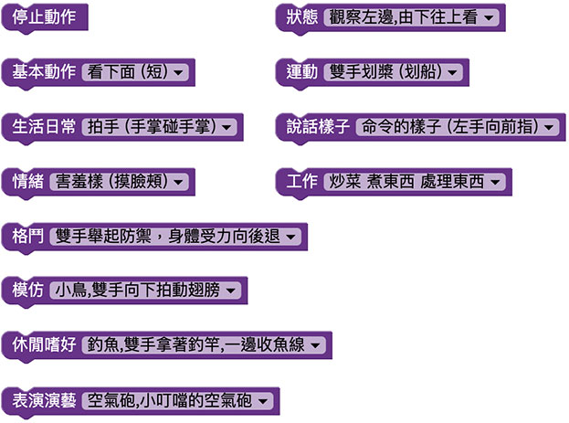

# 動畫表演

凱比機器人內建許多動作和表情搭配的表演行為，豐富的肢體動作和逗趣的表情互相搭配，凱比機器人彷彿化身成一個可愛的小孩子，在身旁開心的唱歌跳舞。

## 動畫表演積木清單

動畫表演積木總共有 11 種類型和一個停止的積木，每個類型又包含數十種動作。

## 機器人依序表演動畫

動畫表演積木在部署執行後，會在一塊積木執行完成後才會繼續執行下一塊積木，下方例子執行後，機器人會依序表演三段動作展示。

