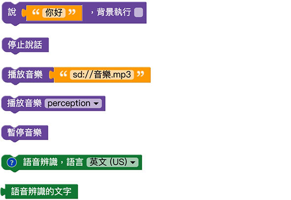

# 聲音

凱比機器人本身內建播放聲音的喇叭，能夠朗讀語音、播放音樂以及進行語音辨識，透過和使用者聲音的互動，更能展現機器人充滿人性化的一面。

## 聲音積木清單

聲音積木包含了說 ( 凱比機器人講話 )、停止說話、播放 mp3 音樂 ( 網路 mp3 或 SD 卡的 mp3 )、播放內建音樂、暫停音樂以及語音辨識。

## 一邊說話一邊播放音樂

使用「說」的積木，勾選背景執行 ( 如此才不會影響到後續的程式 )，搭配「播放 mp3 音樂」的積木 ( 內建音樂不支援同時說話和音樂 )，部署機器人執行後，就會看見機器人邊講話邊播音樂。

> 如果要使用 SD 卡的音樂，可將音樂放入 SD 卡內，路徑輸入「*sd://音樂.mp3*」

## 語音辨識 ( 你說什麼我說什麼 )

將「語音辨識」的積木、「說」的積木放在「重複無限次」的迴圈裡，讓機器人說出「語音辨識的文字」( 此處不要勾選背景執行 )。

部署機器人執行後，機器人就會開始進行語音辨識，辨識時右上角會出現一個麥克風閃爍的圖示，這時對著機器人講話，辨識成功後，機器人就會講出辨識的語句。

