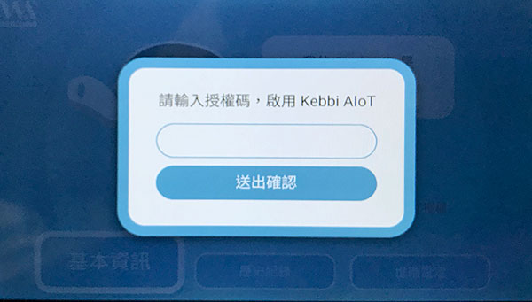
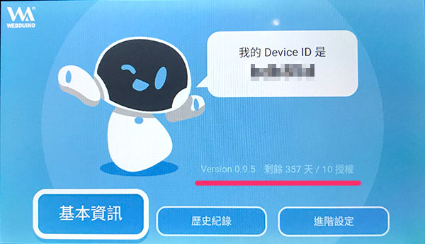
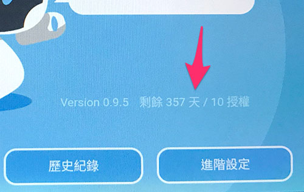
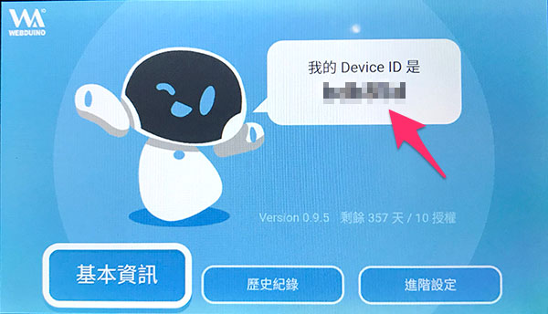

# 授權啟用與設定

如果要使用凱比機器人的物聯網教室 APP，必須進行凱比機器人的授權認證，這篇文章會介紹如何進行物聯網教室 APP 的授權。

> 如果*已經使用過物聯網教室 APP 但沒有密碼*，請往下直接閱讀 [設定密碼與部署模式](#auth05)

## 使用物聯網教室 APP{{auth01}}

用手指在凱比機器人的臉上，從上往下滑動展開選單，點選九宮格的桌面圖示開啟桌面，在桌面上找到「物聯網教室」的 APP，點選開啟物聯網教室。

如果找不到物聯網教室的 APP，可以在桌面上點選「女媧商店」。

在商店的「所有應用」中，找到「物聯網教室」的 APP，點擊進行安裝。

## 第一次使用{{auth02}}

如果是第一次使用物聯網教室，開啟後，會出現「請輸入授權碼，啟用 Kebbi AIoT」的畫面，輸入包裝盒內的授權碼，就可啟用物聯網教室。。

> **如果是 0.94 的版本，請更新凱比機器人和物聯網教室 APP 到 0.95 版本**。

## 檢查使用天數{{auth03}}

啟用之後，在畫面裡可以看到啟用的狀態以及天數。

## 更新授權{{auth04}}

點擊「授權天數」的文字，就可以進行授權碼的更新。

輸入更新的授權碼，就能更新機器人授權。

## 設定密碼與部署模式{{auth05}}

啟用完成後，在開始的畫面可以看到機器人的 ID。

點選「進階設定」，可以修改部署密碼以及部署狀態，這是之後將程式部署到機器人時，可以提供的安全性保護
，修改完成後，按下儲存，設定完成。

