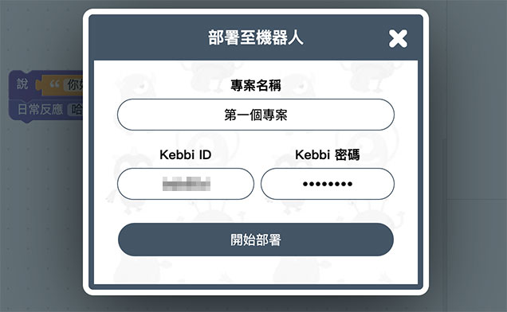

# 程式部署

當機器人的 Wi-Fi 和授權都設定完成後，就可以準備將程式透過物聯網教室 APP，部署到凱比機器人，進一步操控凱比機器人的動作，或是和物聯網套件連動。

## 開啟並登入凱比物聯網教室

使用 Chrome 瀏覽器打開凱比物聯網教室，使用機器人的 ID 和所設定的密碼登入。

> 凱比物聯網教室：[https://kebbi.webduino.io](https://kebbi.webduino.io#_blank)
>
> 機器人授權與密碼設定請參考：[授權啟用與設定](authorize.html)

## 使用 Web:Bit 程式積木

登入後，畫面上有「*Web:Bit 程式積木*」和「*Webduino 影像訓練*」兩個主要功能，點選「Web:Bit 程式積木」，開始編輯凱比機器人的動作程式。

開啟「Web:Bit 程式積木」後，從左側清單找到「凱比機器人」積木。

找出並放入「*說哈囉*」的積木，接著放入「*日常反應哈囉*」的積木。

完成後，將滑鼠移到右上方的「*更多*」選單，點選「*部署到機器人*」。

輸入這個程式的專案名稱，以及登入時的密碼，就能將程式部署到凱比機器人，部署成功後，就會看見凱比機器人先說哈囉，然後手舞足道地揮揮手。

## 再次執行專案

如果想要再次執行這個程式專案，只要用手指在凱比機器人的臉上，往下滑動展開選單，點選九宮格的桌面圖示回到桌面，再次開啟「物聯網教室」APP 之後，點選「歷史專案」，點擊剛剛部署的專案名稱。

點擊「執行專案」，就能再次執行。

