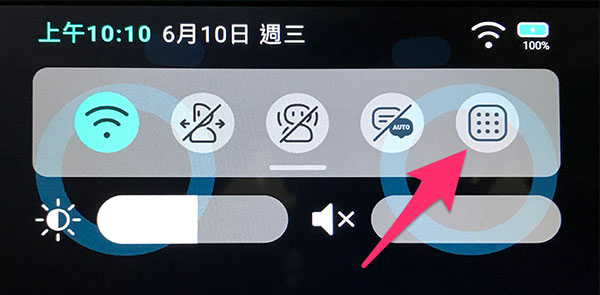
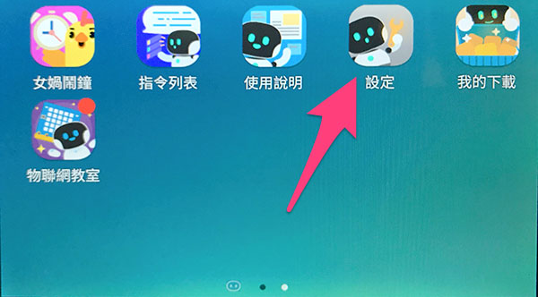

# Wi-Fi 設定

這篇文章會介紹凱比機器人的 Wi-Fi 設定流程，協助大家將凱比機器人連接上所在場所的網路。

## 機器人開機，進入桌面

手指按住凱比機器人頭上的電源鈕，直到將凱比機器人開機。

開機後，用手指在凱比機器人的臉上，從上往下滑動展開選單，點選九宮格的桌面圖示。

點選後，就會開啟凱比機器人的桌面。

## 設定 Wi-Fi 連線

桌面開啟後，找到「設定」的 APP 圖示，點選進入。

選擇左側 Wi-Fi 選項，找到所在場所的網路，輸入網路連線密碼，即可進行網路連線，設定完成後，凱比機器人就能連上所在場所的 Wi-Fi。

